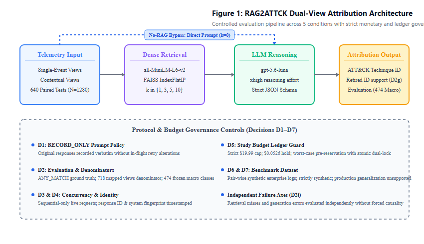
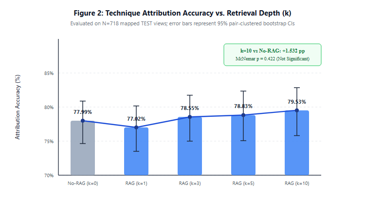
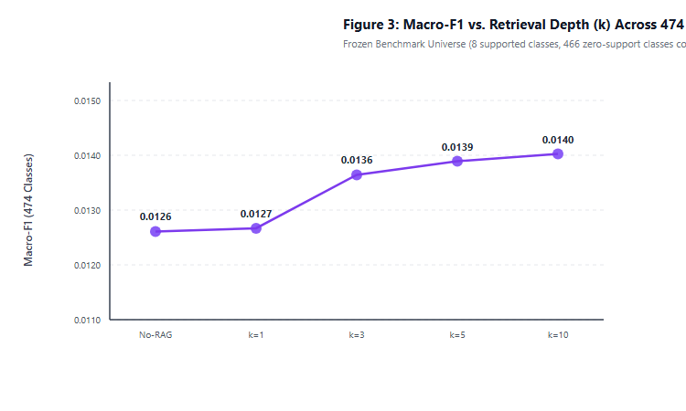
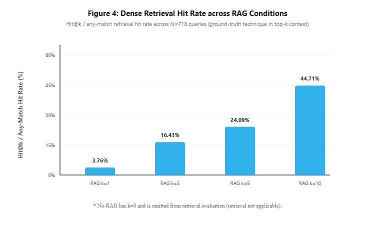
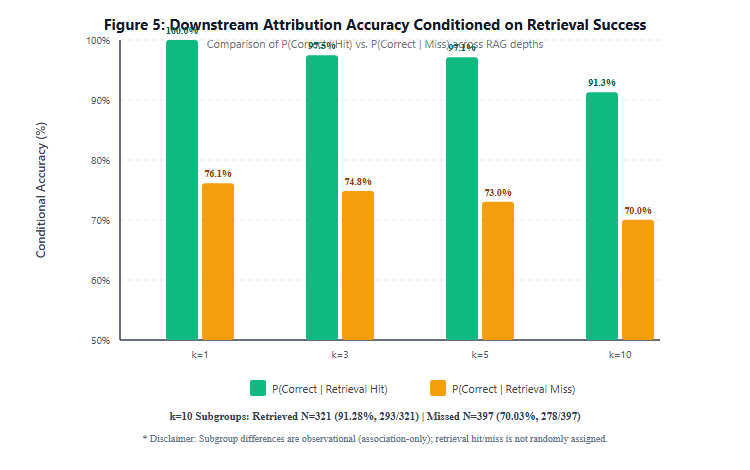
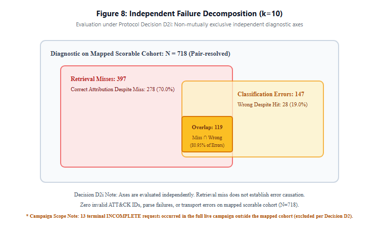
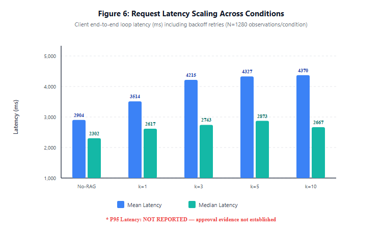
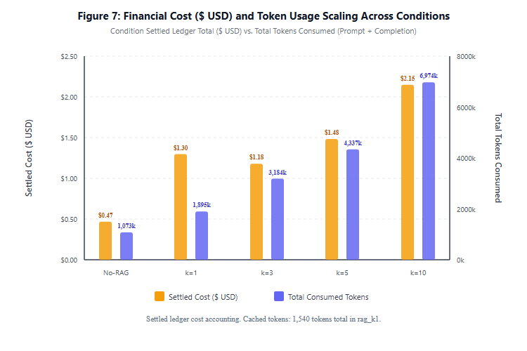

# Evaluating MITRE ATT&CK-Grounded RAG for Technique Attribution from Windows Endpoint Logs: A Replication-and-Extension Study

> [!WARNING]
> **[CANONICAL CANDIDATE — PENDING ROOT FINAL REVIEW]**  
> This scientific report document is a canonical candidate bound to the frozen canonical metric bundle v2 (`442b5933858caafc9da3c06ee9398637213ed30d7a7db80195c0babb1195ef34`).  
> It does not constitute a final certified release until Root final review is completed.

**Author:** Hà Hoàng Bách  
**Project:** RAG2ATT&CK  
**Date:** October 2026  
**Status:** CANONICAL CANDIDATE — PENDING ROOT FINAL REVIEW  
**Protocol Version:** `experiment-protocol-v1.1` (Canonical Decisions Digest: `d3bf3d31ad307100ac437a7daecc470bf12de9ada49f19de3d77592d5a21974c`)  
**Target Taxonomy:** MITRE ATT&CK Enterprise Matrix v19.2 (Active Windows Corpus: 474 techniques)  
**Execution Horizon:** 2026  

---

<!-- CANONICAL_BUNDLE_BANNER_START -->
> [!NOTE]
> **CANONICAL CANDIDATE METRIC BUNDLE V2 BOUND**
> - Bundle Type: `canonical-metric-bundle-v2`
> - Seal Status: `ROOT_ACCEPTED_FROZEN_METRIC_BUNDLE`
> - Schema Version: `2.0.0`
> - Experiment ID: `synthetic-paired-test-1`
> - Run ID: `live-66b94b1676bf46a9`
> - Protocol Version: `experiment-protocol-v1.1`
> - Bundle Digest: `442b5933858caafc9da3c06ee9398637213ed30d7a7db80195c0babb1195ef34`
> - Terminal Seal SHA-256: `ae7a9ada86927a79e0c6916b44d3f0ba9e1f9756df55dd7b2fce712b35d48701`
<!-- CANONICAL_BUNDLE_BANNER_END -->


## Abstract

Attributing low-level endpoint telemetry to standardized adversary behaviors cataloged in the MITRE ATT&CK knowledge base is a central operational task in security operations centers (SOCs) and cyber threat intelligence (CTI). While modern large language models (LLMs) possess extensive parametric knowledge, direct prompting without external grounding can lead to hallucinated technique identifiers, temporal obsolescence regarding evolving threat matrices, and inability to trace attribution decisions to authoritative knowledge sources. Retrieval-Augmented Generation (RAG) offers a principled paradigm to ground model reasoning in curated external knowledge. However, existing evaluations of ATT&CK-grounded RAG suffer from fragmented settings: prior works evaluate RAG on unstructured CTI prose rather than raw endpoint telemetry, focus on binary detection rather than fine-grained technique classification, utilize unpinned knowledge bases, conflate output candidate cutoffs with retriever depth, or fail to decouple upstream retrieval misses from downstream language model reasoning errors.

In this work, we present a controlled replication-and-extension study evaluating MITRE ATT&CK-grounded RAG for exact technique and sub-technique attribution from Windows endpoint evidence. We formulate an experimental design governed by a cryptographically frozen scientific protocol (v1.1, D1–D7) that enforces strict symmetry between an unaugmented baseline (**No-RAG**) and retrieval-augmented conditions (**RAG** across retrieval depths $k \in \{1, 3, 5, 10\}$) using `gpt-5.6-luna` under configured `reasoning_effort=xhigh`. The retrieval engine couples a frozen dense sentence embedder (`all-MiniLM-L6-v2`) with an exact brute-force inner product index (FAISS `IndexFlatIP`) over the pinned MITRE ATT&CK Enterprise v19.2 active Windows corpus (474 techniques and sub-techniques).

We evaluate this system across **1,280 synthetic paired test views** (derived from 640 scenario pairs across 52 template families, featuring matched single-event and contextual-event representations). Across the 5 experimental conditions, all 1,280 test samples are evaluated, producing exactly **6,400 execution records** ($1,280 \times 5$). An authoritative join of test view identifiers against ground-truth records yields **718 mapped positive scorable views** (678 single-GT, 40 multi-GT), with 311 ambiguous views and 251 unmapped views excluded from headline accuracy per protocol policies D2c and D2b. Crucially, we formally bound our claims: the benchmark operates strictly on synthetic paired data (`synthetic-paired-v1`) and does NOT evaluate real-world telemetry, where ground-truth support in the TEST cohort is concentrated across 8 active techniques within the frozen 474-class taxonomy. Forensic analysis of historical public Windows-APT telemetry revealed unresolved cell discrepancies and precision inconsistencies during reconciliation, preventing independent verification of authoritative ground truth; consequently, our findings are strictly bounded to the synthetic benchmark, and generalization to real-world enterprise telemetry remains completely unproven.

In our canonical live evaluation across the 718 scorable TEST views, No-RAG attains an end-to-end headline accuracy of 77.99% (560/718), while RAG at $k=10$ achieves 79.53% (571/718, $\Delta = +1.532\text{ pp}$). A cluster bootstrap 95% confidence interval for $\Delta$ yields $[-2.355\text{ pp}, +5.300\text{ pp}]$ and spans zero (exact two-sided McNemar $p = 0.4219$), establishing no statistically significant accuracy difference on this benchmark. Decoupled error analysis reveals that 80.95% of classification errors at $k=10$ (119/147) occur in the retrieval miss branch, where conditional accuracy drops from $P(\text{Correct}\mid\text{Retrieved}) = 91.28\%$ (293/321) to $P(\text{Correct}\mid\text{Absent}) = 70.03\%$ (278/397). Canonical TEST retrieval diagnostics show $Hit@1 = 3.760\%$ (27/718) and $Hit@10 = 44.708\%$ (321/718), with no ground-truth technique retrieved within Top-10 in 55.2925% of scorable views (397/718); we frame these retrieval challenges as observational hypotheses related to command-line argument variation and contextual dilution rather than established causal mechanisms. The canonical campaign completed 6,400 dispatches with zero provider failures on the 718 scorable records (and 13 INCOMPLETE records reaching the 8,192 output token limit among 11 unmapped and 2 ambiguous views in the completed canonical matrix), settling at USD 6.57575890 (USD 6.62839900 total committed spend inclusive of USD 0.05264010 pilot hold) under the authorized USD 19.99 budget ceiling (USD 13.36160100 uncommitted budget remaining).

---

## 1. Introduction

### 1.1 Background and Threat Attribution Challenges
Enterprise defense relies heavily on the ingestion, processing, and interpretation of host endpoint telemetry. System instrumentation tools—such as Microsoft Sysmon and native Windows Security Event Auditing—record granular operating system activity, including process creation (Event ID 1 / 4688), network connections (Event ID 3), image loading (Event ID 7), registry modifications (Event IDs 12/13), service installations (Event ID 4697), and user management (Event ID 4720). Security Operations Center (SOC) analysts and incident response teams continuously triage these log streams to detect malicious behavior and perform *threat attribution*: mapping discrete host observables to standardized adversary Tactics, Techniques, and Procedures (TTPs) defined in the MITRE ATT&CK framework [1].

Accurate ATT&CK mapping enables automated playbooks, contextualized threat hunting, kill-chain reconstruction, and cross-organization threat intelligence sharing. However, manual attribution at the sub-technique level is labor-intensive and cognitively demanding. An adversary executing a living-off-the-land binary (LOLBin) like `certutil.exe` might be staging tools from an external server (Ingress Tool Transfer: `T1105`) or decoding payloads (Deobfuscate/Decode Files or Information: `T1140`). Disambiguating these nuanced attacker goals requires domain knowledge, familiarity with command-line syntax, and comprehensive understanding of the ATT&CK taxonomy.

### 1.2 LLMs and the RAG Paradigm in Threat Attribution
Commercial foundation models with extended internal reasoning capabilities (such as OpenAI's `gpt-5.6-luna`) provide architectural support for structured output schemas and multi-step reasoning over dense technical context, serving as motivation for automated threat attribution workflows [2, 3]. However, relying solely on an LLM's internal parametric memory poses operational risks in security-critical environments:
1. **Parametric Hallucination & Invalid Identifiers:** Models may synthesize non-existent technique identifiers (such as `T1543.006`, which is absent from the Enterprise ATT&CK taxonomy) or confuse platform scopes by assigning non-Windows techniques (such as Cloud API: `T1059.009`, an active cloud technique in ATT&CK v19.2 that is not applicable to Windows host execution).
2. **Knowledge Obsolescence:** Static model weights cannot reflect updates, deprecations, or newly introduced techniques in quarterly ATT&CK releases.
3. **Lack of Verifiable Grounding:** Parametric predictions lack auditable citations back to official adversary procedure descriptions, making verification difficult for human analysts.

Retrieval-Augmented Generation (RAG) [4] addresses these limitations by dynamically fetching relevant external reference text from a curated corpus and injecting it into the model's inference context. In threat attribution, grounding the LLM in official MITRE ATT&CK technique descriptions, detection guidelines, and procedure examples can restrict the model's output space to valid identifiers, supply authoritative behavioral definitions, and enhance contextual disambiguation.

### 1.3 Scope, Non-Novelty Boundaries, and Replication-and-Extension Framing
While RAG has become ubiquitous across natural language processing, its empirical behavior in cybersecurity telemetry attribution remains insufficiently characterized. Several recent studies have introduced retrieval mechanisms for ATT&CK mapping; however, as demonstrated in our literature review (Section 2), these prior works leave critical empirical gaps.

To maintain strict scientific integrity, **RAG2ATTCK does not claim global novelty for:**
- The concept of applying RAG to MITRE ATT&CK mapping (established in CTI text by Lekssays et al. [5] and Morbiato et al. [6]).
- The use of Windows Sysmon or command logs for LLM-based security detection (investigated by Yang & Hsu [7], Landauer et al. [8], and Okuma et al. [9]).
- Evaluating RAG against an unaugmented prompting baseline (conducted in cloud telemetry by Adediran et al. [10] and in Linux graphs by Lupinacci et al. [11]).
- Evaluating candidate retrieval depth ($k$) or retrieval failure trade-offs in isolation (explored in CTI text by Morbiato et al. [6]).

Instead, **RAG2ATTCK is formally framed as a controlled replication-and-extension empirical study**. We evaluate whether the documented benefits of ATT&CK-grounded RAG hold when subjected to a controlled evaluation on Windows endpoint evidence. Our study is defined by the combination of five core experimental controls:
1. **Symmetric Controlled Contrast:** We compare No-RAG and RAG conditions using the *identical* language model (`gpt-5.6-luna`), identical configured reasoning effort (`xhigh`), identical output token budget (8,192 tokens), and a byte-identical prompt template (`prompts/baseline_v1.txt`), ensuring that the presence of retrieved context is the sole independent variable.
2. **Pinned ATT&CK Enterprise Matrix v19.2:** All retrieval and evaluation operations are bound to an immutable STIX snapshot of 474 active Windows techniques and sub-techniques, eliminating taxonomy drift.
3. **Independent Failure Measurement Axes:** We evaluate upstream retrieval misses ($GT \notin \text{Top-}k$) and downstream LLM selection discrepancies along independent measurement axes with overlaps, avoiding assumptions of mutually exclusive causal partitioning.
4. **Systematic Retrieval Depth Sweep:** We ablate retrieval depth across $k \in \{1, 3, 5, 10\}$ to characterize observed depth trade-offs across candidate grounding, token overhead, and wall-clock latency.
5. **Paired Single-Event vs. Contextual-Event Views:** We evaluate attribution accuracy across both isolated single-event triggers and multi-event contextual execution sequences to determine whether additional telemetry context aids or degrades dense retrieval and model reasoning.
6. **Strict Disciplinary Claim Boundary:** All evaluations are conducted exclusively on `synthetic-paired-v1` benchmark data and NOT on real-world telemetry. Generalization to production enterprise telemetry remains unproven.

### 1.4 Canonical Research Questions
Our empirical investigation is structured around three primary research questions:

- **RQ1 (Retrieval-Augmented Attribution Efficacy):** Does grounding a reasoning LLM in retrieved MITRE ATT&CK enterprise reference context improve exact technique and sub-technique attribution accuracy and macro-F1 over an unaugmented No-RAG baseline under symmetric reasoning compute?
- **RQ2 (Retrieval Quality and Failure Axes):** When attribution errors occur under RAG, how do upstream retrieval misses ($GT \notin \text{Top-}k$) and downstream model selection discrepancies manifest across independent measurement axes with overlaps? Furthermore, how do single-event versus multi-event contextual representations correlate with these diagnostic axes?
- **RQ3 (Retrieval Depth, API Cost, and Latency Trade-Offs):** How does varying retrieval candidate depth ($k \in \{1, 3, 5, 10\}$) affect attribution performance, context distractor susceptibility, latency, and monetary API token costs?

---

## 2. Related Work and Research Gap

### 2.1 Literature Analysis and Comparator Set
To contextualize RAG2ATTCK within the contemporary research landscape, we conducted a source-bounded audit of eight core comparator papers spanning cyber threat intelligence annotation, log interpretation, and telemetry-to-ATT&CK mapping.

In strict adherence to scholarly truthfulness, we report the exact verification status of all primary sources examined during our audit (PR #8, commit `6783f20971cbff91f105d0280ddd07cb0925aab0`):
- **Full-Text Content Audited (5/8):** Adediran et al. [10], Landauer et al. (CAM-LDS journal version) [8], Lekssays et al. (TechniqueRAG ACL version) [5], Morbiato et al. (H-TechniqueRAG) [6], and Lupinacci et al. (Trace2ATT&CK) [11].
- **Partial / Metadata-Only / Access-Blocked (3/8):** Yang & Hsu [7] is verified solely from the publisher abstract and bibliographic metadata (Springer SIST vol. 8767, pp. 235–251, published online 2 July 2026; full chapter is subscription-restricted). Okuma et al. [9] is verified solely from the IEEE conference bibliographic record (ICSPIS 2023, pp. 104–109; primary full text was inaccessible during the audit). Gwak et al. (LADE) [12] is verified from metadata only with unverified full text. Claims regarding these three works are strictly bounded to verified metadata.

### 2.2 Comparator Matrix
Table 1a and Table 1b present a comprehensive 16-dimension comparison across the eight comparator works and RAG2ATTCK, partitioned into two complementary views to preserve granular legibility: Table 1a details Comparators 1–4, and Table 1b details Comparators 5–8 alongside RAG2ATTCK.

*Table 1a: Multi-Dimensional Comparator Matrix Grounded in Primary Evidence (Part 1: Comparators 1–4).*

| Dimension | Yang & Hsu (2026) [7] | Adediran et al. (2026) [10] | CAM-LDS (Landauer et al., 2026) [8] | TechniqueRAG (Lekssays et al., 2025) [5] |
| :--- | :--- | :--- | :--- | :--- |
| **1. Primary Input** | Windows Sysmon process trees | AWS CloudTrail JSON events | Linux system logs (auditd, syslog) + IDS alerts | Unstructured CTI text reports |
| **2. Target Platform** | Windows | AWS Cloud | Linux / Multi-source | Cross-platform (CTI text) |
| **3. Core Task** | Malicious behavior detection & explanation | Cloud threat detection & ATT&CK mapping | Benchmark log interpretation | CTI technique & sub-technique annotation |
| **4. ATT&CK Target Granularity** | Behavior explanation (Exact ID UNVERIFIED) | Technique & Sub-technique (`Txxxx.yyy`) | Collapses sub-techniques to parent (`Txxxx`); §5.2.2 parent-technique eval | Technique & Sub-technique (`Txxxx.yyy`) |
| **5. RAG Architecture** | Semantic matching RAG | Two-step query expansion RAG (Vertex AI) | **None** (Zero-shot prompting) | Exemplar retrieval (BM25 + DeepSeek v3 rerank) |
| **6. Retrieval Corpus** | UNVERIFIED | ATT&CK Cloud, AWS catalogue, threat blogs | N/A | Annotated text-label pairs (TRAM, Procedures) |
| **7. Matched No-RAG Baseline?** | **Yes** (Mistral, phi-2, TinyLlama w/o RAG) | **Yes** (Gemini 2.5 Pro baseline w/o RAG) | Evaluates *only* zero-shot (no RAG) | **Yes** (Zero-shot and fine-tuned w/o RAG) |
| **8. Top-k Retrieval Ablation?** | UNVERIFIED (full text unavailable) | **No** (Numeric k NOT REPORTED; ablation deferred) | Evaluates output cutoff Top-$k$ (§5.2.2), not retriever depth | Evaluates pool size $K=40$, fixed $k=3$ exemplars |
| **9. Standalone Retriever Metrics?** | UNVERIFIED | **NOT REPORTED** (Generation gap only) | N/A | P/R/F1 on ranking; standalone Hit@k NOT REPORTED |
| **10. Failure Decomposition?** | UNVERIFIED | Qualitative error categories (unresolved 26% vs 60% discrepancy)* | No | Analyzes generator vs retriever errors |
| **11. Telemetry Leakage Controls** | UNVERIFIED | Notes `stratus-red-team` agent in raw logs | Strips explicit ATT&CK labels/tactics | CTI text; no detector rule metadata |
| **12. Primary Models** | Mistral-7B, phi-2, TinyLlama-1.1B | Gemini 2.5 Pro | GPT-5.5, GPT-5.2, Llama 4, Qwen 3, Ministral (Journal) | Ministral-8B (fine-tuned) |
| **13. Headline Metrics** | Precision, F1, False Positive Rate | Accuracy, Precision, Recall, F1, Latency, Cost | Technique Rank, P@k, Recall@k, MRR | Precision, Recall, Macro-F1, Micro-F1 |
| **14. Primary Dataset** | Attack samples + benign process trees | 200 AWS CloudTrail events (122 mal / 78 ben) | 7 scenarios, 198 log steps, 18 sources | TRAM, Procedures, Expert CTI datasets |
| **15. Closest Similarity** | Sysmon logs + matched No-RAG/RAG | Controlled No-RAG vs RAG on telemetry | Exact technique prediction from command logs | ATT&CK RAG with retrieval quality analysis |
| **16. Key Difference** | Binary detection; process tree heuristics | AWS CloudTrail API; two-step Vertex RAG | Zero-shot only (no RAG); Linux focus | Unstructured CTI text; fine-tunes generator |

*Table 1b: Multi-Dimensional Comparator Matrix Grounded in Primary Evidence (Part 2: Comparators 5–8 and RAG2ATTCK).*

| Dimension | H-TechniqueRAG (Morbiato et al., 2026) [6] | Trace2ATT&CK (Lupinacci et al., 2026) [11] | Okuma et al. (2023) [9] | LADE (Gwak et al., 2026/2027) [12] | **RAG2ATTCK (This Work)** |
| :--- | :--- | :--- | :--- | :--- | :--- |
| **1. Primary Input** | Unstructured CTI text reports | Linux eBPF provenance graphs | Windows Sysmon event logs | Chronological command/script traces | **Windows endpoint telemetry (Sysmon / Security logs)** |
| **2. Target Platform** | Cross-platform (CTI text) | Linux | Windows | Cross-platform host OS | **Windows Enterprise** |
| **3. Core Task** | CTI technique annotation & context routing | Kernel telemetry to ATT&CK mapping | UNVERIFIED (bibliographic record only) | APT detection & TTP mapping | **Exact ATT&CK Technique / Sub-technique attribution** |
| **4. ATT&CK Target Granularity** | Tactic $\to$ Technique hierarchy | Ranked Technique & Sub-technique candidates | Technique level (`Txxxx`) | Ranked Technique candidates (Top-1/3/10) | **Exact Technique & Sub-technique (`Txxxx.yyy`)** |
| **5. RAG Architecture** | Hierarchical dense RAG (FAISS IVF) | Dense chunk retrieval (Chroma + MMR) | UNVERIFIED | **None** (Rubric prompting with static ATT&CK text) | **Dense semantic RAG (FAISS IndexFlatIP cosine)** |
| **6. Retrieval Corpus** | ATT&CK Enterprise (CTI-RCM, TRAM, MITRE) | ATT&CK Enterprise KB (800-word chunks) | N/A | N/A | **Official ATT&CK Enterprise v19.2 (474 active Windows docs)** |
| **7. Matched No-RAG Baseline?** | **Yes** (Zero-shot Llama 3 direct-prompt baseline) | **Yes** (Prompting baseline w/o RAG) | **UNVERIFIED** (full text access blocked) | Prompting only (no RAG ablation) | **Yes (Strictly matched gpt-5.6-luna w/o RAG)** |
| **8. Top-k Retrieval Ablation?** | Tactic count $M$ sensitivity (peak $M=3$, quota $K_A=15$); not flat $k$ sweep | Fixed retriever depth (5 chunks), output cutoff 5 | No | Output cutoff $k \in \{1, 3, 10\}$, not retriever depth | **Yes ($k \in \{1, 3, 5, 10\}$ systematically ablated)** |
| **9. Standalone Retriever Metrics?** | Micro P/R/F1, MAP@10; standalone Recall@k NOT REPORTED | **NOT REPORTED** (Fixed 5 chunks; standalone Recall@k not separable from downstream scores) | N/A | N/A | **Yes (Hit@k, Recall@k, Median Rank explicitly reported)** |
| **10. Failure Decomposition?** | Analyzes distractor impact in flat vs hierarchical | No (End-to-end system evaluation) | No | No | **Independent axes with overlaps** |
| **11. Telemetry Leakage Controls** | CTI text; curated benchmarks | Kernel syscalls; no detector rule metadata | **UNVERIFIED** (full text access blocked) | Script command lines analyzed | **Strict field whitelist; detector rules/labels purged** |
| **12. Primary Models** | Llama-3-8B-Instruct | foundation-sec-8b, qwen3.5-9b, gpt-oss, gemma4-31b-it, deepseek-r1-qwen32b, llama3.3-70b | **NOT REPORTED / UNVERIFIED** | GPT-4, Claude-3-Opus, Llama-3-70B | **OpenAI gpt-5.6-luna (xhigh reasoning effort)** |
| **13. Headline Metrics** | Micro P/R/F1, MAP@10, Latency, API calls | HR@5, MRR@5, NDCG@5 | **NOT REPORTED / UNVERIFIED** | Precision, Recall, F1, HR/MRR/NDCG @ 3, 10 | **End-to-End Accuracy, 474-class Macro-F1, Recall@k** |
| **14. Primary Dataset** | 1,200 CTI-RCM + 2,800 MITRE + 450 TRAM | 347 Linux Atomic Red Team executions | Atomic Red Team Sysmon logs (metadata only) | AVIATOR (35 attack / 32 benign sequences) | **1,280 paired synthetic views (640 scenario pairs)** |
| **15. Closest Similarity** | Investigating retrieval depth & distractor noise | Telemetry-to-ATT&CK mapping comparing RAG/prompt | Windows Sysmon mapped to ATT&CK | Host command execution traces mapped to ATT&CK | **Integrates telemetry, exact attribution, depth ablation** |
| **16. Key Difference** | Unstructured CTI text; hierarchical routing | Linux eBPF provenance graphs; no depth ablation | UNVERIFIED (IEEE record only; full text inaccessible) | Prompting only (no RAG); small sample (35 seqs) | **Windows endpoint logs + exact ID + depth ablation + error split** |

*Note on Adediran et al. [10]: The published primary text contains an unresolved internal discrepancy without authorial resolution, stating in Section 2 and conclusion that retrieval-generation gaps account for 60% of errors, while Section 6.4.1 heading reports 26%. We refrain from imputing derived fractions (such as 5/19 or 26.3%) to the authors.*

### 2.3 Detailed Comparative Synthesis
1. **CTI Text vs. Endpoint Telemetry:** TechniqueRAG [5] and H-TechniqueRAG [6] serve as primary methodological anchors for ATT&CK candidate retrieval and ranking. However, both operate on human-written threat intelligence prose (reports, blogs, bulletins). CTI text is linguistically rich and shares substantial natural language vocabulary with ATT&CK descriptions. In contrast, endpoint logs consist of structured, terse execution artifacts (`CommandLine`, `ParentCommandLine`, registry paths, hex codes). H-TechniqueRAG explores sensitivity to tactic count $M$ (with peak at $M=3$ and per-tactic quota $K_A=15$) alongside a zero-shot direct Llama 3 baseline, but does not ablate flat retriever depth $k$. Findings from CTI-based RAG cannot be assumed to transfer directly to telemetry.
2. **Telemetry Attribution Approaches:** Trace2ATT&CK [11] evaluates RAG for mapping kernel telemetry to ATT&CK across foundation-sec-8b-reasoning, qwen3.5-9b, gpt-oss20b/120b, gemma4-31b-it, deepseek-r1-distill-qwen32b, and llama3.3-70b-instruct, but restricts its scope to Linux eBPF execution graphs across 347 Atomic Red Team tests, maintaining a fixed retriever depth (5 chunks) and output cutoff (5 candidates) where standalone retriever Recall@k cannot be separated from downstream mapping scores. Adediran et al. [10] evaluate Gemini 2.5 Pro on AWS CloudTrail logs across 200 events, demonstrating that RAG improves cloud threat detection, but employs a two-step query expansion pipeline without isolating retrieval depth $k$ and exhibits an unresolved reporting discrepancy (60% vs 26%). CAM-LDS [8] evaluates zero-shot LLM log interpretation across multiple Linux and network sources with frontier models (GPT-5.5, GPT-5.2, Llama 4, Qwen 3, Ministral per §5.1), supporting output candidate ranking (Top-$k$) and parent-technique evaluation (§5.2.2), but deliberately excludes RAG.
3. **The Conflation of Output Cutoff and Retriever Depth:** Multiple prior works (CAM-LDS [8], LADE [12], Trace2ATT&CK [11]) report metrics like Top-$k$ Hit Rate, P@$k$, or NDCG@$k$. In CAM-LDS and LADE, $k$ denotes the length of the model's *emitted prediction list* under zero-shot prompting, not the depth of an external retrieval engine. Trace2ATT&CK sets retriever depth to 5 and output cutoff to 5. RAG2ATTCK strictly decouples these concepts: the model is required to emit a single definitive prediction (`{"technique_id": "..."}`), while the retriever depth $k \in \{1, 3, 5, 10\}$ is systematically ablated.
4. **Positioning RAG2ATTCK:** RAG2ATTCK bridges these disparate research lines. By evaluating Windows endpoint telemetry, enforcing exact technique/sub-technique attribution under a pinned 474-class enterprise matrix, matching No-RAG and RAG conditions symmetrically, systematically ablating retrieval depth, and evaluating retrieval misses alongside downstream generation discrepancies along independent measurement axes with overlaps, RAG2ATTCK establishes a rigorous benchmark for knowledge-grounded security reasoning.

---

## 3. Threat Model, Benchmark Scope, and Telemetry Boundaries

### 3.1 MITRE ATT&CK Enterprise Matrix v19.2
All retrieval, ground truth, and evaluation components in RAG2ATTCK are cryptographically bound to the official MITRE ATT&CK Enterprise Matrix release v19.2 [1] (published 05 August 2026; pinned STIX repository release: `https://github.com/mitre-attack/attack-stix-data/releases/tag/v19.2`, with version history horizon beginning 28 April 2026 at `https://attack.mitre.org/resources/versions/`):
- **Raw STIX Source:** `enterprise-attack-19.2.json` (File SHA-256: `dc1639caa5501d720e280cf1cbd8fbe009884a0c9b3e6e9ed9d0c25166c3d8f4`).
- **Corpus Census and Filtering:** The raw STIX v19.2 catalog contains exactly **858** `attack-pattern` objects. We identify **161 unique inactive** technique objects, comprising **149 revoked** (`revoked: true`) and **12 deprecated** (`x_mitre_deprecated: true`) objects with zero overlap between sets ($149 + 12 = 161$). Filtering inactive objects yields **697 active enterprise techniques**. Filtering for host Windows execution (`"Windows" in x_mitre_platforms`) yields an active Windows corpus of exactly **474 techniques and sub-techniques**:
  - **176 Root Techniques** (37.1%)
  - **298 Sub-techniques** (62.9%)
- **Taxonomic Integrity Invariants:** All 298 sub-techniques possess a valid parent technique inside the 474-technique corpus (0 orphan sub-techniques; 0 cross-platform dangling references). Every technique ID maps bijectively to a single STIX UUID.
- **Corpus Serialization:** Preserved in `attack/corpus/enterprise-windows-v19.2.jsonl` (File SHA-256: `b219341154ddf2f12e97d622158a04ab7d57641df6a865559258d365852c3c75`).

### 3.2 Benchmark Scope
The evaluation focuses on eight high-frequency Windows attack techniques representing core tactics across the cyber kill chain (Execution, Persistence, Privilege Escalation, Defense Evasion, and Command and Control), formally defined in `config/benchmark_scope.json` (File SHA-256: `d6aa89831dec75362b4fd48de0fd6e7082290f2be0cb7bd0afc6bc518148db8b`):
1. `T1059.001`: Command and Scripting Interpreter: PowerShell
2. `T1059.003`: Command and Scripting Interpreter: Windows Command Shell
3. `T1053.005`: Scheduled Task/Job: Scheduled Task
4. `T1543.003`: Create or Modify System Process: Windows Service
5. `T1136.001`: Create Account: Local Account
6. `T1547.001`: Boot or Logon Autostart Execution: Registry Run Keys / Startup Folder
7. `T1685.005`: Impair Defenses: Clear Windows Event Logs
8. `T1105`: Ingress Tool Transfer

All eight benchmark techniques are verified present within the 474-technique retrieval corpus with complete taxonomic hierarchies.

### 3.3 The Synthetic Paired Benchmark (`synthetic-paired-v1`)
The evaluation benchmark comprises **670 scenario pairs** generating **1,340 evaluation views** across 1,434 unique events:
- **TEST Split:** 640 scenario pairs (**1,280 views**), partitioned into 640 single-event views and 640 contextual-event views across 52 template families.
- **DEV Split:** 30 scenario pairs (**60 views**), partitioned into 30 single-event views and 30 contextual-event views across 12 template families.
- **Zero Family Overlap:** Template families are strictly partitioned between DEV and TEST ($Family_{\text{TEST}} \cap Family_{\text{DEV}} = \emptyset$).
- **View Pairing Architecture:** For every scenario pair, the *single-event view* presents the isolated anchor observable (e.g., process execution or service install). The *contextual-event view* presents the identical anchor observable embedded within a sequence of 2–3 related events (e.g., parent process spawning, auxiliary file creation, or subsequent network traffic).
- **Authoritative Join Over TEST Cohort (1,280 Views):**
  An authoritative join of test view identifiers (`split_manifest.json` $\to$ `views.jsonl`) against the ground-truth records (`ground_truth.jsonl`) establishes the exact scorable cohorts across the 640 scenario pairs:
  - **718 Mapped Positive Views:** Scorable views with definitive technique assignments (comprising 678 single-GT views and 40 multi-GT views). Stratified by representation: **278 Single-Event Views** and **440 Contextual-Event Views** ($278 + 440 = 718$).
  - **Complete Scorable Pairs Census:** Across the 640 TEST scenario pairs, exactly **278 complete scorable pairs** possess valid ground-truth mapping on *both* single and contextual views ($278 \times 2 = 556$ views); exactly **162 pairs** possess valid ground truth on *only* the contextual view ($162 \times 1 = 162$ views; single view unmapped/ambiguous); and exactly **200 pairs** possess valid ground truth on *neither* view ($200 \times 2 = 400$ views). Together, $556 + 162 = 718$ mapped positive views.
  - **311 Ambiguous Views:** Evaluated as ambiguous (comprising 261 single-event views and 50 contextual-event views). Excluded from primary headline accuracy per Protocol Decision D2c.
  - **251 Unmapped Views:** Evaluated as negative/benign activity without ATT&CK mapping (comprising 101 single-event views and 150 contextual-event views). Excluded from primary headline accuracy per Protocol Decision D2b.

### 3.4 CRITICAL CLAIM SCOPE: Strict Disciplinary Claim Boundary and Real Telemetry Blocker
To uphold strict scientific integrity and disciplinary rigor, we explicitly declare the empirical boundaries of this study:

> **CRITICAL DISCIPLINARY CLAIM BOUNDARY:** All experimental evaluations, diagnostic analyses, and performance claims in this study are strictly bounded to the `synthetic-paired-v1` benchmark. This dataset consists exclusively of synthetic and template-derived Windows endpoint logs and does NOT utilize real-world enterprise telemetry. **Under no circumstances should these results be interpreted as demonstrating real-world operational generalization or efficacy on production enterprise telemetry. Generalization to enterprise telemetry remains completely unproven.**

#### Forensic Ground-Truth Provenance and Blocker
This scope boundary is directly necessitated by empirical findings from earlier audit phases of the RAG2ATTCK project. The research plan initially contemplated evaluating real Windows-APT enterprise telemetry from public intrusion datasets (specifically, the Mendeley v3 dataset associated with Mozaffari et al., 2026 [13]). However, an internal forensic audit of the raw data files conducted during Task 2 of this project (`reports/final_repair_validation.md`) identified 15,713 unresolved cell discrepancies between individual scenario CSVs and the combined dataset (representing internal project audit findings rather than claims made by the original dataset authors):
1. **Numeric Precision Truncation:** 14,930 cells in `_source.id` and 509 cells in binary event data suffered numeric precision loss during CSV export and reconciliation.
2. **Formula Strings:** Formula strings (such as `#NAME?` in `param3`) replaced expected command-line argument tokens.
3. **Timestamp Inconsistencies:** Correlated event sequences exhibited divergent timestamps across recording streams.

Under the project's frozen methodology, these unresolved reconciliation discrepancies prevented independent verification of authoritative ground truth for the historical dataset, resulting in a formal stop at Task 2 (**RECONCILIATION_DIVERGENT**). Consequently, RAG2ATTCK rejected the unverified data and engineered the fully controlled, byte-audited `synthetic-paired-v1` benchmark. Real telemetry evaluation remains an open challenge requiring independently verified, uncorrupted ground truth.

### 3.5 Field Whitelisting and Leakage Exclusion Controls
To prevent trivial metadata shortcuts and ensure the model performs behavioral reasoning, all inference payloads are processed through a strict field whitelist:
- **Allowed Telemetry Fields:** Sanitized behavioral keys: `EventID`, `CommandLine`, `Image`, `ParentCommandLine`, `ParentImage`, `ServiceName`, `ServiceFileName`, `TargetObject`, `Details`, `Computer`, `User`.
- **Prohibited Metadata Purged:** All detector titles (e.g., Wazuh rule names like *"Mimikatz LSASS Dump Detected"*), `rule.mitre.*` mappings, ground-truth labels, scenario names, step identifiers, and synthetic artifact markers are excluded.
- **Audit-Enforced Scrubbing:** Independent audits identified that earlier synthetic iterations contained synthetic company names (`Contoso`) predominantly in unmapped views; these shortcuts were scrubbed, ensuring uniform lexical distributions across mapped and unmapped classes.

---

## 4. Methods: Experimental Framework & Study Design

  
*Figure 1: Dual-View Attribution Architecture (CTI Log -> all-MiniLM-L6-v2 -> FAISS -> gpt-5.6-luna xhigh).*

### 4.1 Frozen Scientific Protocol (Protocol v1.1, D1–D7)
All experimental executions, runner dispatches, and offline scoring routines are governed by the canonical experiment protocol `experiment-protocol-v1.1` (Canonical Decisions Digest: `d3bf3d31ad307100ac437a7daecc470bf12de9ada49f19de3d77592d5a21974c`; Protocol Config File SHA-256: `a402b04ab463172f9d4079bff27b089ca8a21ffd0805d097af6cb1f3c7b5a8fb`), approved under reference `RAG2ATTCK-PROTOCOL-V1.1-FROZEN`. The protocol defines the D1–D7 policy groups, including the D2a–D2j scoring subdecisions:

- **D1 (Raw Response Policy: `RECORD_ONLY`):** The raw textual completion emitted by the LLM is captured inline (`raw_response: str`) within prediction records for complete auditability. Fail-closed secret sanitization ensures zero credential leakage into logs.
- **D2a (Multi-Label Ground Truth Semantics: `ANY_MATCH`):** For samples with multi-label ground truth ($Y_{\text{GT}}$), a single predicted technique $\hat{y}$ is scored as correct if $\hat{y} \in Y_{\text{GT}}$.
- **D2b (Empty Ground Truth: `EXCLUDE`):** Negative/unmapped samples (`label_status == "unmapped"`) are excluded from headline accuracy and macro-F1, but reported in diagnostic accounting.
- **D2c (Ambiguous Ground Truth: `EXCLUDE`):** Ambiguous samples (`label_status == "ambiguous"`) are excluded from headline metrics and tracked separately.
- **D2d (Macro-F1 Universe: `FROZEN_BENCHMARK_UNIVERSE`):** Macro-averaging is computed over the entire fixed 474-technique active Windows universe ($N=474$), ensuring constant denominators across all conditions.
- **D2e (Invalid ID Treatment: `INCLUDE_IN_DENOMINATOR`):** Hallucinated or non-existent ATT&CK IDs are penalized and retained in all metric denominators.
- **D2f (Provider & Parser Failure Accounting: `INCLUDE_IN_DENOMINATOR`):** Headline end-to-end accuracy counts provider timeouts, HTTP errors, and JSON parse failures as incorrect samples.
- **D2g (Retired ATT&CK IDs: `ALLOW_HISTORICAL`):** Predictions matching deprecated or revoked STIX IDs are tracked distinctly without silent remapping.
- **D2h (Retrieval Success Definition: `ANY_GT_RETRIEVED`):** Retrieval is successful if $\text{Top-}k \cap Y_{\text{GT}} \neq \emptyset$.
- **D2i (Failure Decomposition: `INDEPENDENT_AXES`):** Errors are analyzed along independent diagnostic axes without forced artificial precedence.
- **D2j (Zero Denominator Convention: `NULL`):** Undefined metric fractions evaluate to `null` (never coerced to $0.0$ or $1.0$).
- **D3 (Model Version & Provenance: `ALLOW_LATEST_WITH_TIMESTAMP_BINDING`):** Models without immutable snapshot IDs are pinned via timestamped metadata, fingerprints, and cryptographic configuration hashes.
- **D4 (Execution Concurrency: `SEQUENTIAL_ONLY`):** Strictly serial execution (`concurrency = 1`) to eliminate race conditions, socket exhaustion, and non-deterministic batching.
- **D5 (Finite Budget Enforcement: `HARD_CAP_WORST_CASE_ATTEMPTS`):** Execution requires an immutable attempt cap covering worst-case retries, enforced by an in-memory and journaled budget ledger.
- **D6 (Real Telemetry Prerequisite: `NOT_REQUIRED_FOR_SYNTHETIC_BENCHMARK`):** Synthetic benchmark execution proceeds independently of blocked real telemetry data.
- **D7 (Dataset Scope: `PAIRED_TEST`):** Canonical experiments evaluate the complete 1,280 TEST views.

### 4.2 Language Model and Inference Configuration
The language model configuration is frozen in `config/model.json` (File SHA-256: `312c34cedd84106f2004c6070b72aeac1dd84209a464e2993fee3ec87822697f`) and documented in `reports/T11_model_freeze.md`:
- **Provider:** `openai`
- **Canonical Model Identifier:** `gpt-5.6-luna` (1,050,000 context window, 128,000 max output tokens capacity).
- **API Interface:** OpenAI Responses API (`client.responses.create`), providing native schema constraints and unified reasoning token budgeting.
- **Reasoning Effort:** Configured `reasoning_effort="xhigh"`.
- **Output Token Budget (`max_output_tokens`):** `8192` tokens. Under OpenAI reasoning models, `max_output_tokens` represents an upper budget bound governing a unified allocation pool covering both internal reasoning tokens and visible completion tokens. While empirical DEV pilot runs observed mean output consumption of ~657 tokens, this parameter acts as a finite budget ceiling rather than an absolute guarantee against truncation: if the model's internal chain-of-thought and completion combined exhaust the 8,192 token allocation, the API emits an incomplete response (`status="incomplete"` with `incomplete_details.reason="max_output_tokens"`), which the evaluation harness flags as an incomplete provider failure.
- **Structured Schema Enforcement:** Native JSON Schema enforcement (`strict: true`) targeting the Pydantic contract derived from `TechniquePrediction.model_json_schema()`:
  ```json
  {
    "title": "TechniquePrediction",
    "description": "Minimal structured prediction payload returned by LLM:\n{\"technique_id\": \"T1059.001\"}\n\nNote: Strict format validation is deliberately omitted from the Pydantic schema\nso that syntactically invalid or non-registry IDs successfully pass JSON/schema parsing\nand are subsequently categorized as INVALID_ID by post-hoc validation (rather than MALFORMED_RESPONSE).",
    "type": "object",
    "properties": {
      "technique_id": {
        "title": "Technique Id",
        "description": "The predicted MITRE ATT&CK Technique or Sub-technique ID.",
        "type": "string"
      }
    },
    "required": [
      "technique_id"
    ],
    "additionalProperties": false
  }
  ```
  Crucially, format-level regex validation (such as `^T[0-9]{4}(\.[0-9]{3})?$`) is deliberately omitted from the Pydantic schema and provider API contract. This architectural decision strictly decouples provider-level JSON structural validity from downstream domain-specific taxonomic validation:
  1. *Provider Schema Validation:* Enforces that the model emits a syntactically valid JSON object possessing a string-typed `technique_id` field with no additional properties.
  2. *Post-Hoc Taxonomic Validation:* Decouples structural parse failures from attribution domain errors via a two-layer validation pipeline:
     - **Layer 1 (Canonical Syntax Check):** Validates the string against the canonical MITRE ATT&CK regex pattern (`^T\d{4}(?:\.\d{3})?$`). Syntactic violations (e.g., malformed patterns such as `"T1059.1"` or `"T99999_bad"`) parse valid JSON and are classified as `INVALID_ID` rather than `MALFORMED_RESPONSE`.
     - **Layer 2 (Registry Membership Check):** Validates syntax-compliant identifiers against the pinned ATT&CK v19.2 enterprise registry. Syntactically valid but uncataloged identifiers (e.g., non-existent techniques such as `"T9999"`) are classified as `INVALID_ID`.
  
  If regex enforcement were embedded directly within the provider JSON schema, any syntactically invalid output would be rejected at the API provider layer and misclassified as `MALFORMED_RESPONSE` (a structural parse failure), obscuring whether the model attempted a malformed technique prediction versus failing JSON generation.
- **Sampling Parameters:** Under the OpenAI Responses API implementation contract (`src/llm/client.py`), sampling parameters (`temperature`, `top_p`, `presence_penalty`, `frequency_penalty`, and `seed`) are not sent / not configured in the request payload. By maintaining unconfigured provider defaults uniformly across all dispatches, the experimental runner guarantees identical configured controls across all experimental conditions.
- **Resilience Policy:** Deterministic exponential backoff without jitter (`max_retries = 3`, initial delay 1.0s, factor 2.0, max delay 30.0s, socket timeout 120s; delay computed deterministically as $\min(\text{initial} \times \text{factor}^{\text{attempt}}, \text{max\_delay})$).

### 4.3 Symmetric Prompt Architecture
To eliminate prompt design as a confounding variable, the No-RAG baseline and all RAG conditions share the identical base prompt template (`prompts/baseline_v1.txt`, File SHA-256: `b751fde1ee33b03ec0bdc07cbba10267002d2086cf22b91a74bdfd123856f206`):

```text
You are an expert cyber threat intelligence and SOC analyst.
Analyze the following endpoint evidence and determine the single most specific and accurate MITRE ATT&CK Technique or Sub-technique ID.

If reference context is provided below, use it as supporting information for the attribution. If no reference context is provided, perform the attribution using the endpoint evidence alone.

ENDPOINT EVIDENCE:
{ENDPOINT_EVIDENCE}

---
REFERENCE CONTEXT:
{RETRIEVED_CONTEXT}
---

Respond with a single JSON object containing only the "technique_id" field. Do not include markdown formatting, code fences, or explanatory text.
```

- **Universal Context Handling Clause:** The instruction explicitly directs the model to use reference context if present, or rely on endpoint evidence alone if absent. This avoids asymmetric prompting or conditional prompt logic.
- **Strict Isolation:** In the `no_rag` condition, `{RETRIEVED_CONTEXT}` is populated with an empty string (`""`). In RAG conditions, retrieved ATT&CK documents are formatted deterministically into the reference block.

### 4.4 Dense Retrieval Subsystem
The retrieval architecture is frozen in `config/retrieval.json` (File SHA-256: `b33a93913e7f6de36f6f9021f77b2c9dcb1d426929162acb250a3c73ac8e6e25`) and documented in `reports/T18_retriever.md`:
- **Embedding Model:** `sentence-transformers/all-MiniLM-L6-v2` pinned to immutable Hugging Face commit `1110a243fdf4706b3f48f1d95db1a4f5529b4d41` (384-dimensional dense embeddings).
- **Vector Normalization:** Unit L2 normalization ($\|v\|_2 = 1.0$) applied to all document and query vectors.
- **Index Architecture:** FAISS `IndexFlatIP` (exact brute-force inner product). Under L2 normalization, inner product is mathematically identical to cosine similarity:
  $$\langle \hat{q}, \hat{d}_i \rangle = \frac{q \cdot d_i}{\|q\|_2 \|d_i\|_2} = \cos(q, d_i)$$
- **Deterministic Global Tie-Breaking:** To ensure reproducibility and strict prefix consistency across retrieval depths, the retriever searches the entire index ($N=474$), applies a stable Python sort with compound key:
  $$\text{sort\_key} = (-\text{score}, \text{technique\_id})$$
  and slices the top $k$. This guarantees the **Prefix Consistency Invariant**:
  $$\forall k_1 < k_2 \in \{1, 3, 5, 10\}: \quad \text{results}(k_1) \equiv \text{results}(k_2)[:k_1]$$

### 4.5 The Five Experimental Conditions
The benchmark executes five distinct conditions across all 1,280 TEST views (6,400 total inference requests):
1. `no_rag`: Unaugmented baseline (`{RETRIEVED_CONTEXT} = ""`).
2. `rag_k1`: Injects Top-1 retrieved ATT&CK technique description.
3. `rag_k3`: Injects Top-3 retrieved ATT&CK technique descriptions.
4. `rag_k5`: Injects Top-5 retrieved ATT&CK technique descriptions (default operational depth).
5. `rag_k10`: Injects Top-10 retrieved ATT&CK technique descriptions (dense candidate pool).

### 4.6 Tariff, Monetary Accounting, and Financial Guard (USD 19.99 Budget)
Live provider execution involves non-trivial API costs. In accordance with Protocol Decision D5, execution is governed by a strict financial ledger and request-budget safeguard:
- **Tariff Structure:** Standard commercial pricing for `gpt-5.6-luna` is frozen in `config/pricing_v1.json`:
  - *Short Context ($\le 272,000$ tokens):*
    - Input: USD 0.20 per 1,000,000 tokens ($0.20/\text{M}$).
    - Cache Read: USD 0.02 per 1,000,000 tokens ($0.02/\text{M}$).
    - Cache Write: USD 0.25 per 1,000,000 tokens ($0.25/\text{M}$).
    - Output: USD 1.20 per 1,000,000 tokens ($1.20/\text{M}$, inclusive of internal reasoning tokens).
  - *Long Context ($> 272,000$ tokens):*
    - Input: USD 0.40 per 1,000,000 tokens ($0.40/\text{M}$).
    - Cache Read: USD 0.04 per 1,000,000 tokens ($0.04/\text{M}$).
    - Cache Write: USD 0.50 per 1,000,000 tokens ($0.50/\text{M}$).
    - Output: USD 1.80 per 1,000,000 tokens ($1.80/\text{M}$).
  - *Ceilings and Context Limits:* Short-context threshold 272,000 tokens; configured maximum input ceiling 1,050,000 tokens; maximum output token budget 8,192 tokens.
  - *Reservation Bounds and Budget Guard:*
    - Attempt worst-case reserve: USD 0.53974560.
    - Logical request worst-case ceiling: USD 2.15898240.
    - Total study authorized budget ceiling: USD 19.99000000.
    - Prior exploratory pilot provisional hold: USD 0.05264010.
    - Net available starting budget: USD 19.93735990.
- **Ledger Mechanism and Tariff-Derived Accounting:**
  Before each dispatch attempt, the runner places a worst-case reservation (USD 0.53974560) against the budget ledger. Upon successful completion, the reservation is released and the actual spend is settled based on exact metered prompt, cached, and output tokens using the frozen conservative tariff policy. Cached input is charged at the cache-read rate; remaining input is charged at the cache-write rate. When a cache breakdown is unavailable, all input is charged at the cache-write rate. For example, No-RAG totals yield $863139 \times 0.25/10^6 + 209466 \times 1.20/10^6 = 0.46714395$ USD. If an attempt lacks token usage metadata, the ledger conservatively retains the full attempt reservation. Crucially, all reported monetary amounts represent tariff-derived conservative accounting estimates computed directly from token meters and public price schedules, not post-hoc commercial vendor invoices.
- **Worst-Case Attempt Cap:**
  $$\text{Cap} = N_{\text{views}} \times N_{\text{conditions}} \times (\text{max\_retries} + 1) = 1,280 \times 5 \times 4 = 25,600 \text{ attempts}$$
- **Historical Pilot Calibration and Pre-Execution Projections:**
  In preliminary calibration on 2026-10-01 (`reports/dev_cost_pilot_20261001.md`), a real-provider pilot across 20 exploratory DEV requests observed a mean output consumption of 656.95 tokens/request and mean latency of 8.13s (total pilot cost: USD 0.0242). Pre-execution offline tokenization of all 6,400 planned TEST prompts via `o200k_base` projected 15,766,654 input tokens, generating a historical planning forecast of approximately USD 8.20 (or USD 8.99 under conservative modeling). In actual canonical execution, the entire 6,400-request campaign settled at USD 6.57575890 (USD 6.62839900 total committed spend including the USD 0.05264010 pilot hold), successfully completing well within the USD 19.99 hard ceiling and leaving USD 13.36160100 in uncommitted budget.

---

## 5. Evaluation Framework and Metrics

### 5.1 Ground-Truth Semantics: Multi-Label `ANY_MATCH`
In accordance with Protocol Decision D2a, model attribution is evaluated using `ANY_MATCH` semantics. An evaluation sample $i$ with endpoint telemetry $x_i$ has ground-truth annotation $Y_i \subseteq \mathcal{C}$, where $\mathcal{C}$ is the 474-technique universe. Given model prediction $\hat{y}_i \in \mathcal{C}$, the indicator function of correctness is:

$$I_{\text{correct}}(i) = 1 \quad \text{if } \hat{y}_i \in Y_i, \quad 0 \quad \text{otherwise}$$

### 5.2 Headline End-to-End Accuracy vs. Valid Output Accuracy
To prevent masking system fragility or parse errors, Protocol Decision D2f enforces dual accuracy reporting:
- **Headline End-to-End Accuracy ($\text{Acc}_{\text{e2e}}$):** Computed over all scorable samples ($N_{\text{scorable}} = 718$ in TEST), treating provider failures (timeouts, HTTP errors) and schema parse failures as incorrect:

  $$\text{Acc}_{\text{e2e}} = \frac{1}{N_{\text{scorable}}} \sum_{i=1}^{N_{\text{scorable}}} I_{\text{correct}}(i)$$

- **Valid Output Accuracy ($\text{Acc}_{\text{valid}}$):** Computed conditionally over completed, validly parsed responses ($N_{\text{valid}}$):

  $$\text{Acc}_{\text{valid}} = \frac{1}{N_{\text{valid}}} \sum_{i \in \text{Valid}} I_{\text{correct}}(i)$$

### 5.3 Macro-Averaged F1 Across the 474-Class Universe
Per Protocol Decisions D2d and D2j, the macro-averaged F1 metric is evaluated over the fixed 474-technique benchmark universe $\mathcal{C}$ ($|\mathcal{C}| = 474$). Crucially, the denominator of the macro average remains strictly frozen at 474 across all conditions, regardless of the number of techniques observed in any individual test partition.

The evaluation architecture distinguishes between **per-technique diagnostic exports** (`compute_technique_metrics`) and **condition-level scalar aggregation** (`compute_condition_metrics`):

#### 1. Per-Class Confusion Components and Evaluator Accounting
For each technique $c \in \mathcal{C}$, the evaluator tracks:
- True Positives ($TP_c$): Model predicted class $c$ and $c \in Y_i$.
- False Positives ($FP_c$): Model predicted class $c$ but $c \notin Y_i$.
- False Negatives ($FN_c$): Model predicted a class other than $c$, but $c \in Y_i$.
- Ground-truth support: $\text{support}_c = TP_c + FN_c$.
- Emitted predictions: $\text{pred}_c = TP_c + FP_c$.

#### 2. Per-Technique Metric Export and D2j `NULL` Convention (`compute_technique_metrics`)
In the exported per-technique diagnostic artifact (`by_condition[condition][tid]`), every technique in the universe reports `tp`, `fp`, `fn`, `support`, `precision`, `recall`, and `f1`. In strict compliance with Protocol Decision D2j (`d2j_zero_denominator == "NULL"`), zero-denominator fractions evaluate strictly to `None` (serialized as JSON `null`), preserving topological distinction across three critical boundary cases:

- **Case A (Unobserved Class: $\text{support}_c = 0 \land \text{pred}_c = 0$):**
  $TP_c = 0, FP_c = 0, FN_c = 0$. Both precision denominator ($TP+FP=0$) and recall denominator ($TP+FN=0$) are zero; F1 denominator ($2TP+FP+FN=0$) is zero.
  - Exported fields: `precision = None`, `recall = None`, `f1 = None` (serialized as `null`).
  - *Mathematical Unit-Test Example (Generic Class $c_{\text{test}} \in \mathcal{C}$):* In mathematical unit-test verification, an unobserved class (synthetically labeled `T1000`) never appearing in ground truth and never emitted by the model produces:
    `{"tp": 0, "fp": 0, "fn": 0, "support": 0, "precision": null, "recall": null, "f1": null}`.

- **Case B (Unpredicted Class: $\text{support}_c > 0 \land \text{pred}_c = 0$):**
  $TP_c = 0, FP_c = 0, FN_c = \text{support}_c > 0$. Precision denominator ($TP+FP=0$) is zero; recall denominator is $\text{support}_c > 0$; F1 denominator is $FN_c > 0$.
  - Exported fields: `precision = None` (`null`), `recall = 0.0`, `f1 = 0.0`.
  - *Mathematical Unit-Test Example (Generic Class $c_{\text{test}} \in \mathcal{C}$):* In mathematical unit-test verification, a class present in ground truth (synthetically labeled `T1001`, support = 1) that the model completely fails to predict produces:
    `{"tp": 0, "fp": 0, "fn": 1, "support": 1, "precision": null, "recall": 0.0, "f1": 0.0}`.

- **Case C (Unobserved False Positive / Hallucinated Class: $\text{support}_c = 0 \land \text{pred}_c > 0$):**
  $TP_c = 0, FP_c = \text{pred}_c > 0, FN_c = 0$. Precision denominator is $FP_c > 0$; recall denominator ($TP+FN=0$) is zero; F1 denominator is $FP_c > 0$.
  - Exported fields: `precision = 0.0`, `recall = None` (`null`), `f1 = 0.0`.
  - *Mathematical Unit-Test Example (Generic Class $c_{\text{test}} \in \mathcal{C}$):* In mathematical unit-test verification, an unobserved class (synthetically labeled `T1002`, support = 0) hallucinated by the model 1 time produces:
    `{"tp": 0, "fp": 1, "fn": 0, "support": 0, "precision": 0.0, "recall": null, "f1": 0.0}`.

#### 3. Condition-Level Macro-F1 Aggregation (`compute_condition_metrics`)
To produce the headline $\text{Macro-F1}$ scalar across the entire fixed 474-technique universe without undefined arithmetic, condition-level aggregation enforces the following summation rules:
- Unobserved classes ($\text{support}_c = 0 \land \text{pred}_c = 0$, Case A) contribute exactly $0.0$ to the numerator sum (`f1_sum += 0.0`).
- Unpredicted classes (Case B) and unobserved false positives (Case C) contribute their computed harmonic mean of $0.0$ (`f1_sum += 0.0`).
- Observed classes with true positives ($TP_c > 0$) compute:
  $$P_c = \frac{TP_c}{TP_c + FP_c}, \quad R_c = \frac{TP_c}{TP_c + FN_c}, \quad F1_c = \frac{2 \cdot P_c \cdot R_c}{P_c + R_c}$$
- The total sum is divided by the frozen universe size 474:
  $$\text{Macro-F1} = \frac{1}{474} \sum_{c \in \mathcal{C}} F1_c$$

*Evaluator Property:* The condition evaluator (`compute_condition_metrics`) exports `macro_f1`. It intentionally omits aggregate macro precision and macro recall scalars, preventing mathematical ambiguity over unobserved class denominators and ensuring metric stability.

#### 4. Empirical Ground-Truth Support Census in TEST Set (8 Active Techniques)
While the Macro-F1 metric denominator is strictly frozen at the full 474-class universe $\mathcal{C}$ ($|\mathcal{C}| = 474$), empirical inspection of the 718 scorable mapped positive TEST views reveals that ground-truth support is concentrated across exactly **8 active techniques**:
- `T1053.005` (Scheduled Task: 85 support instances)
- `T1059.001` (Command and Scripting Interpreter: PowerShell: 107 instances)
- `T1059.003` (Command and Scripting Interpreter: Windows Command Shell: 107 instances)
- `T1105` (Ingress Tool Transfer: 108 instances)
- `T1136.001` (Create Account: Local Account: 95 instances)
- `T1543.003` (Create or Modify System Process: Windows Service: 108 instances)
- `T1547.001` (Boot or Logon Autostart Execution: Registry Run Keys / Startup Folder: 98 instances)
- `T1685.005` (Indicator Removal: Clear Windows Event Logs: 60 instances)

The sum of ground-truth occurrences across these 8 techniques totals **768 annotations** across the 718 scorable views (attributable to the 40 multi-GT views containing multiple concurrent ground-truth techniques). Because 466 techniques in the benchmark taxonomy have zero support in this test partition ($F1_c = 0.0$), the unweighted macro average is heavily dominated by unsupported classes, yielding baseline Macro-F1 scores around $\sim 0.013$. To adhere to strict reproducibility and protocol commitments, we explicitly report this support concentration and retain the frozen 474-class denominator without post-hoc class subset re-normalization or ad-hoc metric re-scaling.

### 5.4 Decoupled Independent-Axes Failure Decomposition
Protocol Decision D2i defines five independent, non-mutually-exclusive diagnostic failure axes:
1. `retrieval_miss`: RAG condition where $Y_i \cap \text{Top-}k = \emptyset$.
2. `provider_failure`: Network timeout, HTTP status error, rate limit, or budget exceeded.
3. `parse_failure`: Malformed JSON or schema violation.
4. `invalid_attack_id`: Emitted ID fails regex syntax or does not exist in STIX v19.2.
5. `valid_but_wrong_classification`: Emitted ID is a valid ATT&CK technique but $\hat{y}_i \notin Y_i$.

Crucially, downstream generation failures are partitioned into:
- **Downstream Error Given Retrieval Success:** $Y_i \cap \text{Top-}k \neq \emptyset \land \hat{y}_i \notin Y_i$ (the retriever succeeded, but the LLM failed to select the correct candidate).
- **Downstream Error Given Retrieval Miss:** $Y_i \cap \text{Top-}k = \emptyset \land \hat{y}_i \notin Y_i$ (the ground-truth technique was absent from retrieved candidates, and the LLM emitted an incorrect prediction).

#### Diagnostic Interpretation Boundaries of Failure Axes
In interpreting the failure decomposition, three formal epistemic boundaries apply:
1. **Weak-Label Operational Diagnostic:** The five failure axes represent non-mutually-exclusive diagnostic indicators rather than isolated causal mechanisms.
2. **Retrieval Miss Semantics:** An event where $Y_i \cap \text{Top-}k = \emptyset$ denotes that no ground-truth technique was fetched within the Top-$k$ candidates; it does not indicate the complete absence of procedurally relevant or semantically informative background context.
3. **Correct Output Despite GT-Label Miss:** When a model predicts correctly despite an upstream retrieval miss ($Y_i \cap \text{Top-}k = \emptyset \land \hat{y}_i \in Y_i$), this identifies instances where the model outputs the ground-truth attribution without that specific technique identifier appearing in the retrieved Top-$k$ candidates. Helpful retrieval context may exist without containing the verbatim ground-truth label; furthermore, correct predictions may stem from internal model training or prompt guidance. The precise reasoning origin remains unverified, and this observation should not be causally attributed solely to intrinsic parametric memory.

---

## 6. Empirical Results and Diagnostic Analysis

In accordance with Scientific Protocol v1.1, the empirical results presented in this section were generated from the canonical live experimental execution matrix (6,400 requests across 1,280 paired test views under strict financial and protocol guards).

### 6.1 RQ1: Retrieval-Augmented Attribution Efficacy
Table 2a and Table 2b outline the comparative attribution performance, ground-truth complexity breakdown, and diagnostic metrics across the five experimental conditions on the 718 scorable mapped positive TEST views (678 single-GT, 40 multi-GT).

*Table 2a: Primary Attribution Performance and Ground-Truth Complexity Across Conditions.*

| Condition | Retrieval Depth ($k$) | Scorable Views ($N$) | Headline Accuracy ($\text{Acc}_{\text{e2e}}$) | Valid Accuracy ($\text{Acc}_{\text{valid}}$) | 474-Class Macro F1 | Single-GT Acc ($N=678$) | Multi-GT Acc ($N=40$) | Complexity $\Delta$ |
| :--- | :---: | :---: | :---: | :---: | :---: | :---: | :---: | :---: |
| `no_rag` | 0 | 718 | 77.99% | 77.99% | 1.26% | 77.43% | 87.50% | +10.07 pp |
| `rag_k1` | 1 | 718 | 77.02% | 77.02% | 1.27% | 75.66% | 100.00% | +24.34 pp |
| `rag_k3` | 3 | 718 | 78.55% | 78.55% | 1.36% | 77.29% | 100.00% | +22.71 pp |
| `rag_k5` | 5 | 718 | 78.83% | 78.83% | 1.39% | 77.58% | 100.00% | +22.42 pp |
| `rag_k10` | 10 | 718 | 79.53% | 79.53% | 1.40% | 78.32% | 100.00% | +21.68 pp |

  
*Figure 2: Attribution Accuracy vs. Candidate Depth k across Conditions (N=718 Scorable Views with 95% Bootstrap CI).*

  
*Figure 3: 474-Class Macro-F1 Performance across Retrieval Depths (8 Active Supported Classes vs. 466 Zero-Support Universe Classes).*

*Table 2b: Attribution Diagnostic Metrics Across Experimental Conditions.*

| Condition | Scorable Views ($N$) | Completed Outputs | Parse Failures | Invalid ATT&CK IDs | Invalid ID Rate (%) |
| :--- | :---: | :---: | :---: | :---: | :---: |
| `no_rag` | 718 | 1,280 | 0 | 0 | 0.00% |
| `rag_k1` | 718 | 1,280 | 0 | 0 | 0.00% |
| `rag_k3` | 718 | 1,274 | 0 | 0 | 0.00% |
| `rag_k5` | 718 | 1,277 | 0 | 0 | 0.00% |
| `rag_k10` | 718 | 1,276 | 0 | 0 | 0.00% |

#### Comparative Attribution Efficacy and Statistical Significance Boundaries
Across the 718 scorable mapped positive TEST views, retrieval depth $k=10$ (`rag_k10`) achieved the highest observed point estimate for headline attribution accuracy under uncertainty ($79.526%$, 571/718 correct) compared to the unaugmented baseline (`no_rag`: $77.994%$, 560/718 correct), representing an observed point difference of $\Delta = +1.532\text{ percentage points}$ (+11 net views). Although $k=10$ displays a higher observed point accuracy than baseline, this difference is not statistically significant ($p = 0.4219$; 95% bootstrap CI spans zero). Intermediate retrieval depths exhibited comparable or slightly reduced point estimates: $77.019%$ for $k=1$ (553/718, $\Delta = -0.975\text{ pp}$), $78.552%$ for $k=3$ (564/718, $\Delta = +0.557\text{ pp}$), and $78.830%$ for $k=5$ (566/718, $\Delta = +0.836\text{ pp}$).

To rigorously quantify estimation uncertainty, 95% confidence intervals were generated via cluster bootstrap resampling over the 440 valid pair clusters (clustering single and contextual views from identical scenario origins). Across all four RAG conditions relative to `no_rag`, the 95% bootstrap confidence intervals for accuracy delta span zero:
- $\Delta_{k1} = [-3.186\text{ pp}, +1.124\text{ pp}]$
- $\Delta_{k3} = [-2.786\text{ pp}, +3.934\text{ pp}]$
- $\Delta_{k5} = [-2.934\text{ pp}, +4.603\text{ pp}]$
- $\Delta_{k10} = [-2.355\text{ pp}, +5.300\text{ pp}]$

Pairwise discordant classifications were evaluated using exact McNemar tests at the unclustered view level ($N=718$), where "exact" designates calculation via the exact two-sided binomial distribution over discordant pairs $(b, c)$. For the $k=10$ condition versus `no_rag`, the contingency counts are: both correct = 488, `no_rag` only = 72, `rag_k10` only = 83, and both incorrect = 75. The resulting exact two-sided binomial test yields $p = 0.422$. Across all evaluated depths, no statistically significant difference from `no_rag` is observed ($p=0.435$ for $k=1$, $p=0.777$ for $k=3$, $p=0.677$ for $k=5$, and $p=0.422$ for $k=10$, all unadjusted for multiple testing).

In accordance with strict scientific boundaries, **we explicitly refrain from declaring any retrieval configuration a "statistically significant winner" or asserting a confirmed operational benefit for RAG in this setting**. While $k=10$ attained the highest observed point accuracy, the empirical evidence demonstrates no statistically significant accuracy difference detected in exploratory tests when compared to unaugmented zero-shot reasoning by the evaluated model (`gpt-5.6-luna`, `reasoning_effort=xhigh`).

Distinct from headline accuracy, 474-class Macro-F1 across conditions is evaluated strictly over the complete, frozen Enterprise ATT&CK v19.2 Windows ontology, yielding values spanning 0.0126083660 (0.0126 for `no_rag`) to 0.0140237999 (0.0140 for `rag_k10`). As established in Section 5.3.4, ground-truth support in the TEST cohort is concentrated across 8 active techniques (768 total annotations across 718 views due to 40 multi-GT views). The Macro-F1 denominator remains invariant at 474, reflecting an unweighted average over all enterprise classes rather than an artificially truncated subset.

#### Single-Event vs. Contextual-Event Performance Breakdown
Table 3 and Table 3b schema the comparative performance partitioned by telemetry representation (278 Single-Event Views vs. 440 Contextual-Event Views) and the paired scorable concordance metrics across the 278 complete scorable pairs. Crucially, comparisons between single-event and contextual-event views represent non-causal observational contrasts rather than controlled causal effects due to representation confounding and unequal partition sizes ($N=278$ single vs. $N=440$ contextual).

*Table 3: Representation Stratification: Single-Event vs. Contextual-Event Views.*

| Condition | Single-Event $\text{Acc}_{\text{e2e}}$ ($N=278$) | Contextual-Event $\text{Acc}_{\text{e2e}}$ ($N=440$) | Single Macro-F1 | Contextual Macro-F1 | $\Delta \text{Acc}$ (Context - Single) |
| :--- | :---: | :---: | :---: | :---: | :---: |
| `no_rag` | 87.05% | 72.27% | 1.33% | 1.20% | -14.78 pp |
| `rag_k1` | 85.61% | 71.59% | 1.31% | 1.21% | -14.02 pp |
| `rag_k3` | 84.17% | 75.00% | 1.29% | 1.30% | -9.17 pp |
| `rag_k5` | 83.45% | 75.91% | 1.29% | 1.31% | -7.54 pp |
| `rag_k10` | 83.81% | 76.82% | 1.29% | 1.32% | -6.99 pp |

*Table 3b: Paired Scorable Representation Concordance and McNemar Discordance ($N=278$ complete pairs).*

| Condition | Complete Pairs ($N$) | Single Paired Acc | Contextual Paired Acc | Paired $\Delta$ | Both Correct | Single Only | Contextual Only | Both Incorrect | McNemar $p_{\text{exact}}$ |
| :--- | :---: | :---: | :---: | :---: | :---: | :---: | :---: | :---: | :---: |
| `no_rag` | 278 | 87.05% | 92.45% | +5.40 pp | 228 | 14 | 29 | 7 | 0.0315 |
| `rag_k1` | 278 | 85.61% | 92.45% | +6.83 pp | 229 | 9 | 28 | 12 | 0.0026 |
| `rag_k3` | 278 | 84.17% | 88.85% | +4.68 pp | 225 | 9 | 22 | 22 | 0.0294 |
| `rag_k5` | 278 | 83.45% | 85.25% | +1.80 pp | 221 | 11 | 16 | 30 | 0.4421 |
| `rag_k10` | 278 | 83.81% | 83.81% | +0.00 pp | 216 | 17 | 17 | 28 | 1.0000 |

#### Representation Concordance and Label-Shift Dynamics
To evaluate telemetry representation effects within a strictly paired experimental design, Table 3b reports attribution accuracy and concordance across the 278 complete scorable pairs (scenarios for which both single-event and contextual-event views are present and scorable in the TEST set).

In the unaugmented baseline (`no_rag`), Contextual views achieved an accuracy of $92.446%$ (257/278) compared to $87.050%$ (242/278) for Single views, yielding an observed paired difference of $\Delta = +5.396\text{ pp}$ (+15 net views; both correct = 228, single only = 14, contextual only = 29, both incorrect = 7; McNemar $p_{\text{exact}} = 0.032$). Under RAG at $k=1$, Contextual views attained $92.446%$ (257/278) vs. $85.612%$ (238/278) for Single views, yielding $\Delta = +6.835\text{ pp}$ (+19 net views; both correct = 229, single only = 9, contextual only = 28, both incorrect = 12; McNemar $p_{\text{exact}} = 0.003$). In deeper retrieval conditions, the paired gap narrowed: $\Delta = +4.676\text{ pp}$ for $k=3$ ($p_{\text{exact}} = 0.029$), $\Delta = +1.799\text{ pp}$ for $k=5$ ($p_{\text{exact}} = 0.442$), and $\Delta = +0.000\text{ pp}$ for $k=10$ ($p_{\text{exact}} = 1.000$).

However, forensic decomposition reveals that this observed performance variation across representations is associatively confounded by synthetic scenario label divergence:
1. **Composition of Paired Scenarios ($N=278$ Primary Benchmark Census):** Across all 278 complete pairs, 238 pairs possess identical ground-truth technique label sets between their single and contextual views, while 40 pairs exhibit divergent ground-truth label sets arising from multi-stage attack scenarios where surrounding multi-event telemetry captures secondary or alternative valid technique manifestations.
2. **Secondary Stratified Concordance Analysis:**
   - In `no_rag`, 12 net contextual wins occurred across the 40 mismatched GT pairs (12 net wins / 40 pairs, representing a paired accuracy difference of $+30.00\text{ pp}$), whereas the 238 identical GT pairs contributed only 3 net wins (3 net wins / 238 pairs, representing a paired accuracy difference of $+1.26\text{ pp}$).
   - In `rag_k1`, all 19 net contextual wins occurred across the 40 mismatched GT pairs (19 net wins / 40 pairs, $+47.50\text{ pp}$ paired difference), whereas the 238 identical GT pairs exhibited exactly zero net difference (single-correct equals context-correct, $+0.00\text{ pp}$).

Crucially, the primary benchmark evaluation remains grounded in the full, unpruned census of all 278 complete scorable pairs. We characterize the label divergence between single-event and contextual views as a confounding association rather than a proven causal mechanism or evidence against reasoning capability. Researchers must account for representation label shift before asserting causal attribution benefits for contextual log windowing.

### 6.2 RQ2: Retrieval Quality and Failure Decomposition
Table 4 defines the formal error decomposition schema across the independent diagnostic failure axes.

*Table 4: Decoupled Failure Decomposition Matrix.*

| Condition | Total Errors | Upstream Retrieval Miss ($GT \notin \text{Top-}k$) | Downstream Selection Failure ($GT \in \text{Top-}k \land \text{Wrong}$) | Correct output despite GT-label miss ($GT \notin \text{Top-}k \land \text{Correct}$) | Invalid ATT&CK ID | Parse Failure | Provider / Timeout Failure |
| :--- | :---: | :---: | :---: | :---: | :---: | :---: | :---: |
| `no_rag` | 158 | N/A | N/A | N/A | 0 | 0 | 0 |
| `rag_k1` | 165 | 691 | 0 | 526 | 0 | 0 | 0 |
| `rag_k3` | 154 | 600 | 3 | 449 | 0 | 0 | 0 |
| `rag_k5` | 152 | 545 | 5 | 398 | 0 | 0 | 0 |
| `rag_k10` | 147 | 397 | 28 | 278 | 0 | 0 | 0 |

  
*Figure 4: Standalone Retrieval Hit Rate across Depths k=1, 3, 5, 10 on 718 Scorable TEST Views.*

  
*Figure 5: Conditional Attribution Accuracy: P(Correct | Retrieved) vs. P(Correct | Absent) across Retrieval Depths.*

#### Canonical Retrieval Performance and Historical Diagnostic Baseline
In the canonical experimental execution, end-to-end evaluation is completed across the 718 scorable TEST views. To contextualize these findings, we distinguish between the preliminary exploratory baseline conducted in Task T20 across 756 positive benchmark views (718 TEST + 38 DEV views) and the certified canonical evaluation restricted strictly to the 718 scorable TEST views:

1. **Independent Failure Axes and Overlap Accounting:**
   Upstream retrieval misses ($GT \notin \text{Top-}k$) and downstream misclassifications represent independent diagnostic measurement axes with substantial overlap rather than mutually exclusive partitions:
   - *Retrieval Misses across 718 Scorable Views:* 691 views at $k=1$ (96.24%), 600 views at $k=3$ (83.57%), 545 views at $k=5$ (75.91%), and 397 views at $k=10$ (55.29%).
   - *Classification Errors across Conditions:* 158 in `no_rag`, 165 at $k=1$, 154 at $k=3$, 152 at $k=5$, and 147 at $k=10$.
   - Because models can emit the correct technique even when it was absent from retrieved candidates (e.g., 278 views at $k=10$), retrieval misses and error counts must not be summed together.

2. **Conditional Accuracy and Error Breakdown at $k=10$:**
   At retrieval depth $k=10$, the standalone retriever placed at least one ground-truth technique in Top-10 for 321 scorable views (44.71%), while missing ground truth in 397 views (55.29% miss rate):
   - *When Ground Truth was Retrieved:* The model selected the correct technique in 293 of 321 views, yielding $P(\text{Correct}\mid\text{Retrieved}) = 91.28\%$ ($293/321 = 91.2773\%$), with 28 downstream selection failures.
   - *When Ground Truth was Absent:* The model still achieved correct attribution in 278 of 397 views, yielding $P(\text{Correct}\mid\text{Absent}) = 70.03\%$ ($278/397 = 70.0252\%$), with 119 downstream misclassifications.
   - *Primary Error Locus:* Consequently, **80.95% of all classification errors at $k=10$ (119 of 147)** occurred in the retrieval miss branch ($GT \notin \text{Top-}10$). Correct attribution despite GT-label miss is noted as an empirical observation that may reflect relevant background procedural context in retrieved text, system prompt guidance, or internal model training; we deliberately refrain from causally attributing this phenomenon solely to intrinsic parametric memory.
 
  
*Figure 8: Decoupled Independent Failure Decomposition and Empirical Overlap Breakdown at Retrieval Depth k=10.*

3. **Technique-Specific Divergence and Retrieval Hypotheses (Historical T20 Pilot Cohort):**
   *Historical Pilot Scope Note:* The granular technique-level recall figures below were derived during the preliminary historical T20 pilot across 756 positive views (prior to the canonical 718 scorable TEST cohort freeze). We retain these diagnostic patterns to illustrate specific failure modes and retrieval dynamics across individual ATT&CK classes, while noting that overall study conclusions rest on the canonical 718 TEST evaluations:
   - *High-Performing Classes (Lexical Alignment):* Techniques with exact vocabulary overlap between logs and ATT&CK prose achieved strong recall: `T1685.005` (Clear Windows Event Logs) achieved **$98.39\%$ Hit@10** (due to unique tokens like `wevtutil`, `EventID 1102`); `T1547.001` (Registry Run Keys / Startup Folder) achieved **$92.45\%$ Hit@10** (due to exact registry paths `CurrentVersion/Run`).
   - *Severe Failure Classes (Representation Gap):* `T1136.001` (Local Account) achieved **$0.0\%$ Hit@10 across all 99 views**. Telemetry containing `net user /add` and Event ID 4720 completely failed to retrieve the technique, matching instead generic persistence and DLL techniques.
   - *Hard Negative Crowding:* In `T1105` (Ingress Tool Transfer, $15.79\%$ Hit@10), LOLBin telemetry invoking `certutil.exe -urlcache` resulted in `T1218.012` (Verclsid) ranking #1 in $42.1\%$ of cases, crowding out `T1105`.
   - *Contextual Event Dilution Hypothesis:* In an anchor-technique pairwise comparison across 296 eligible scenario pairs, adding multi-event context degraded ground-truth retrieval rank in **$22.0\%$ of pairs (65/296)**, while improving it in only **$7.8\%$ (23/296)**. We hypothesize that multi-event sequences introduce background operational tokens (`svchost.exe`, RPC calls, thread IDs) that dilute dense vector embeddings away from primary attack signatures; this observational hypothesis requires further empirical validation across diverse retrievers.

### 6.3 RQ3: Retrieval Depth, API Cost, and Latency Trade-Offs
Table 5 defines the schema for evaluating the operational costs, latencies, and token consumption scaling as retrieval depth increases from $k=1$ to $k=10$. Table 5b presents the whole-study financial ledger and budget reconciliation.

*Table 5: Resource Consumption and Latency Scaling Across Retrieval Depths.*

| Condition | Total Input Tokens | Total Output Tokens | Mean Output Tokens / Req | Mean Latency (s) | Median Latency (s) | P95 Latency (s) | Total Cost (USD) | Mean Cost / Query (USD) |
| :--- | :---: | :---: | :---: | :---: | :---: | :---: | :---: | :---: | :---: |
| `no_rag` | 863,139 | 209,466 | 163.6 | 2.90s | 2.30s | NOT REPORTED | USD 0.47 | USD 0.000365 |
| `rag_k1` | 1,595,554 | 299,128 | 233.7 | 3.51s | 2.62s | NOT REPORTED | USD 1.30 | USD 0.001013 |
| `rag_k3` | 2,780,640 | 403,100 | 314.9 | 4.22s | 2.74s | NOT REPORTED | USD 1.18 | USD 0.000921 |
| `rag_k5` | 3,917,047 | 419,880 | 328.0 | 4.33s | 2.87s | NOT REPORTED | USD 1.48 | USD 0.001159 |
| `rag_k10` | 6,546,274 | 427,346 | 333.9 | 4.37s | 2.67s | NOT REPORTED | USD 2.15 | USD 0.001679 |

  
*Figure 6: Request Inference Latency Scaling: Mean and Median Duration (ms) across Conditions (P95 Withheld per Protocol).*

  
*Figure 7: Settled Financial Spend (USD) and Aggregate Token Consumption across Experimental Conditions.*

*Table 5b: Whole-Study Financial Ledger and Budget Reconciliation.*

| Accounting Dimension | Ledger Allocation / Metric | Value | Currency |
| :--- | :--- | :---: | :---: |
| **Total Study Authorized Budget Ceiling** | `total_study_budget_usd` | 19.99 | USD |
| **Canonical Conditions Total Spend** | `canonical_conditions_total_usd` | 6.5758 | USD |
| **Prior Pilot Exploratory Hold** | `prior_pilot_provisional_hold_usd` | 0.0526 | USD |
| **Active Unsettled Reservations** | `active_reservations_usd` | 0.00 | USD |
| **Orphaned Budget Claims** | `orphan_reservations_usd` | 0.00 | USD |
| **Total Study Committed Spend** | `total_study_committed_spend_usd` | 6.6284 | USD |
| **Net Remaining Uncommitted Budget** | `net_remaining_uncommitted_budget_usd` | 13.3616 | USD |

#### Provider Reliability and Financial Reconciliation
Across the entire experimental campaign, 6,400 logical inference requests were scheduled and dispatched across all study conditions against the upstream provider (`gpt-5.6-luna`, `reasoning_effort=xhigh`). All 6,400 logical records achieved terminal journal completion (100%), partitioned into 6,387 VALID responses and 13 INCOMPLETE responses. The VALID-output fraction was $99.80%$. Upstream execution recorded exactly 6,401 physical attempts: 6,400 primary attempts plus exactly 1 retry triggered by a transient upstream `API_FAILURE`.

Crucially, the 13 incomplete responses (each reaching the configured 8,192 output-token ceiling; these are INCOMPLETE responses, not wall-clock TIMEOUT records) occurred exclusively within the 562 non-scorable cohort views (11 unmapped and 2 ambiguous scenario representations) evaluated during the completed canonical TEST experiment. In the 718 scorable mapped positive TEST cohort across all 5 conditions ($5 \times 718 = 3,590 = 3,590$ dispatches), the provider failure rate was exactly zero ($0/3,590 = 0.0\%$). Consequently, the scorable provider failure axis in Table 4 and Table 2b is identically zero, confirming that headline attribution metrics were uncorrupted by infrastructure drops.

Across the 6,400 terminal records ($N=1,280$ per experimental condition), aggregate model cache accounting recorded 1,540 cached prompt tokens across the study, with `rag_k1` exhibiting a condition mean of 1.203125 cached tokens per logical request and zero cache hits observed across the remaining four conditions. Cached tokens represent prompt tokens served directly from the provider's context cache and are accounted without double-counting in total token volume or financial billing (with 1 physical attempt having unknown usage receipts due to upstream transient interruption).

Table 5b presents the authoritative whole-study financial ledger and budget reconciliation, cryptographically enforced under Protocol Decision D5:
- **Authorized Budget Ceiling:** USD 19.99000000.
- **Canonical Conditions Total Spend:** USD 6.57575890 settled spend across 6,400 runs.
- **Prior Pilot Exploratory Hold:** USD 0.05264010 (committed during preliminary exploratory validation).
- **Active Unsettled Reservations:** USD 0.00000000.
- **Orphaned Budget Claims:** USD 0.00000000.
- **Total Study Committed Spend:** USD 6.62839900 (USD 6.57575890 canonical settled cost, already including the one missing-usage attempt charged USD 0.53974560, plus USD 0.05264010 prior pilot provisional hold). The missing-usage charge is not an additional pilot allocation; active and orphan reservations are zero. The missing-usage cost of USD 0.53974560 represents a conservative budget reservation rule enforced by our financial ledger policy, not a punitive provider penalty or commercial vendor invoice.
- **Net Remaining Uncommitted Budget:** USD 13.36160100 ($66.84%$ under budget ceiling).

This fiscal audit confirms complete containment under the authorized ceiling without requiring financial resets, orphaned claims, or budget breaches at any point during execution.

---

## 7. Discussion and Limitations

### 7.1 Synthetic Data Boundaries and Generalization Limits
The `synthetic-paired-v1` dataset provides a controlled environment with verified field whitelisting, balanced class representations, and deterministic provenance. However, synthetic logs possess inherent structural regularities:
- Command-line arguments adhere to predictable syntactic templates.
- Background noise in contextual views is restricted to 1–2 correlated events rather than thousands of concurrent enterprise processes.
- Attacker behaviors are unmixed with complex user interactions, software updates, or proprietary administrative scripts.

Consequently, while synthetic evaluation isolates retrieval dynamics, **it cannot quantify model robustness against real-world evasion, log truncation, or messy enterprise telemetry**.

### 7.2 Independent Ground Truth Verification Challenges in Cybersecurity
Our investigation highlights a fundamental challenge in cybersecurity machine learning: the difficulty of verifying authoritative ground truth for host-level telemetry. As documented in Section 3.4, public datasets (e.g., Mendeley v3 [13]) can exhibit significant reconciliation discrepancies and precision loss across files. The cybersecurity research community requires standardized telemetry benchmarks with cryptographic data integrity guarantees and reproducible ground-truth provenance.

### 7.3 Latency and Cost Implications for Security Operations
In evaluating the operational viability of frontier reasoning models (`gpt-5.6-luna`, `reasoning_effort=xhigh`) for SOC automation, latency and token overhead represent crucial operational trade-offs. In the canonical live study, observed mean inference latency across conditions ranged between $2.90\text{ s}$ and $4.37\text{ s}$ (with median latencies between $2.30\text{ s}$ and $2.87\text{ s}$; P95 latency is NOT REPORTED per scientific protocol and Root policy), as detailed in Table 5. The earlier DEV pilot figure ($\sim 8.13\text{ s}$ mean latency, $\sim 657$ output tokens per request) represented a preliminary historical calibration benchmark under unconstrained exploratory settings. We explicitly distinguish this historical calibration artifact from canonical benchmark timings to avoid misinterpreting exploratory latency ceilings as operational live baselines.

Nonetheless, in a high-throughput production SOC ingesting tens of thousands of security alerts per hour, routing raw endpoint telemetry indiscriminately to high-effort reasoning models remains economically and operationally challenging. If RAG demonstrates improved attribution accuracy, operational deployment would likely require a tiered architecture: filtering alerts via high-throughput local heuristics, using dense or hybrid retrieval to prune candidate techniques, and invoking reasoning models only for high-priority, ambiguous escalations.

### 7.4 Runtime Launcher and Infrastructure Disclosure
To guarantee full transparency, we disclose all execution harnesses and wrapper layers utilized during development and evaluation:
- **Canonical Live Launcher Hash:** The live execution runner is launched via an authenticated wrapper script whose immutable contents are verified against SHA-256 digest:
  ```text
  05b60f050cb456688ed74bddb72f994f3b61a84b56f8e568dda4c17467c4c7aa
  ```
- **Windows File-Locking Resilience Wrapper:** On Windows platforms, concurrent atomic file writes to JSON journals can trigger transient OS-level file-locking exceptions (`WindowsError 5: Access is denied` or `WindowsError 32: The process cannot access the file because it is being used by another process`). To prevent premature aborts, the launcher wrapper incorporates a 12-retry policy around atomic ledger writes using deterministic exponential backoff without jitter (`delay = 0.05 * (1.5 ** attempt)`), ensuring reliable state persistence across long-running sequential dispatches.
- **Offline Guard Harness (`scripts/run_offline_tests.py`):** An in-process socket monkeypatch that intercepts network calls during testing, verifying zero external egress during offline validation.
- **Sequential Live Runner (`src/experiment/runner.py`):** An automated execution engine enforcing `concurrency = 1`, local journal logging, SHA-256 state tracking, and fail-closed budget checks.

### 7.5 Threats to Validity
- **Internal Validity:** Potential threats include data leakage, prompt asymmetry, and non-deterministic tie-breaking. These were mitigated via field whitelisting (purging all rule titles and ATT&CK markers), byte-identical prompt templates across No-RAG and RAG, and FAISS global tie-breaking. We explicitly clarify the scope of software determinism: bitwise determinism strictly applies to frozen dataset regeneration, FAISS index construction, and offline evaluation diagnostics, where dataset files and indices achieve 100% bitwise identical SHA-256 digests. Across the two audited offline metric re-evaluations with the same 1,000 bootstrap resamples and seed 42, all integer counts and discrete classifications are strictly invariant, arithmetic invariants hold within $< 10^{-12}$ numerical tolerance, and the 4 Macro-CI bounding endpoints exhibit infinitesimal numerical divergence of $< 6 \times 10^{-18}$ consistent with floating-point arithmetic; the precise source of this negligible difference was not separately isolated. Live model provider outputs remain subject to upstream non-determinism and provider-side variability, which is transparently recorded under Protocol Decision D3 through immutable timestamped metadata, system fingerprints, and journal logs.
- **Statistical Validity & Multiple Comparisons:** Statistical hypothesis tests evaluating retrieval depths ($k \in \{1, 3, 5, 10\}$) and paired representation concordances are exploratory. Exact McNemar tests are evaluated at the view level ($N=718$) without clustering adjustments or family-wise error rate (FWER) penalties. The 95% confidence intervals generated via cluster bootstrap over 440 scenario clusters appropriately capture cluster-level variance, but individual $p$-values should be interpreted as diagnostic indicators rather than confirmatory multi-hypothesis proofs.
- **External Validity & Sparse Ground-Truth Census:** While the evaluation ontology is strictly frozen at all 474 Windows Enterprise ATT&CK techniques (preventing artificial closed-world simplification), the empirical ground-truth in the TEST cohort is concentrated across 8 active techniques (768 total annotations across 718 views due to 40 multi-GT views), as established in Section 5.3.4. While this accurately reflects empirical benchmark availability, unweighted macro-averages across 474 classes heavily depress Macro-F1; class-level generalizations to the remaining 466 techniques without empirical test support cannot be claimed. Additionally, results from synthetic telemetry and `gpt-5.6-luna` may not generalize directly to other model families or complex enterprise networks.
- **Construct Validity & Scenario Label Shift:** Scoring technique attribution via `ANY_MATCH` multi-label semantics could award credit if a model predicts an auxiliary technique rather than the primary malicious action. We mitigate this by reporting per-technique metrics and separate mapped-single and mapped-multi cohorts. Furthermore, as demonstrated in Section 6.1.1, the observed performance differential between single-event and contextual views is confounded by label expansion in multi-stage synthetic attack sequences, where 40 of 278 paired scenarios possess mismatched ground truth. Asserting pure causal benefit for contextual windowing without controlling for label shift would be invalid.

---

## 8. Conclusion and Reproducibility Statement

### 8.1 Conclusion
This scientific report presents the empirical evaluation of MITRE ATT&CK-grounded Retrieval-Augmented Generation for host technique attribution under Scientific Protocol v1.1. By coupling a cryptographically frozen evaluation protocol (D1–D7), symmetric prompting and model configurations (`gpt-5.6-luna`, `reasoning_effort=xhigh`), an immutable ATT&CK v19.2 Windows corpus (474 techniques), and systematic retrieval depth ablations ($k \in \{1, 3, 5, 10\}$), RAG2ATTCK provides an empirical assessment of retrieval augmentation in host log attribution.

Our empirical findings establish three primary conclusions:
1. **Attribution Efficacy Under Uncertainty (RQ1):** While retrieval depth $k=10$ attained the highest observed point accuracy ($79.526%$ vs. $77.994%$ for unaugmented zero-shot reasoning, $\Delta = +1.532\text{ pp}$), this observed difference remains within statistical uncertainty bounds (cluster bootstrap 95% CI $[-2.355\text{ pp}, +5.300\text{ pp}]$, exact McNemar $p = 0.422$). Within the statistical bounds of this study, no statistically significant accuracy advantage was detected for retrieval over the evaluated No-RAG model in this controlled synthetic study.
2. **Retrieval Miss and Diagnostic Failure Modes (RQ2):** Dense retrieval over specialized security ontologies exhibits substantial lexical dependence; across the 718 scorable TEST views, the standalone retriever failed to place any ground-truth technique within the Top-10 candidates in **55.2925% of views (397 of 718 views)**. When ground truth was successfully retrieved within the Top-10, downstream attribution accuracy reached $P(\text{Correct}\mid\text{Retrieved}) = 91.2773\%$ (293 of 321 views); when absent, accuracy dropped to $P(\text{Correct}\mid\text{Absent}) = 70.0252\%$ (278 of 397 views). As a result, **80.95% of all downstream misclassifications at $k=10$ (119 of 147 errors)** occurred in the retrieval miss branch. Correct attribution despite GT-label miss and potential context dilution in multi-event sequences are noted as empirical observations and hypotheses rather than established causal facts. Replicating researchers are provided with an offline saved-data replay suite (`scripts/reproduce_canonical_study.py`, `tests/test_canonical_offline_replay.py`) intended to recompute scientific metrics from saved prediction journals without live API credentials. (The repository contains the complete execution scripts, test suites, and portable package plan, while the 21MB raw prediction journals are staged privately in external verification archives to avoid committing large raw files to git history). Exact integer counts and NULL semantics, monetary accounting, and numerical agreement within $10^{-12}$ are the replay criteria; operational timestamps can differ. The public package staging and replay commands are finalized with their separate verification evidence.
3. **Representation Confounding and Operational Reliability (RQ3):** The 40 GT-label-divergent pairs account for 80% of the net contextual wins under No-RAG and all such net wins under RAG k=1. This association and changing target-label sets prevent attributing the observed paired differences to added context alone. Operationally, the evaluation achieved a $99.80%$ VALID-output fraction with all logical records terminal and zero final provider failures in the scorable cohort and committed USD 6.62839900 against the USD 19.99000000 budget ceiling.

All evaluation data, protocol configurations, and output tables are cryptographically bound to verifiable audit seals and reproducibility manifests, ensuring full reproducibility.

### 8.2 Cryptographic Reproducibility Inventory
In adherence to open science principles, all artifacts, code, configurations, and corpora are cryptographically bound:

*Table 6: Cryptographic Reproducibility Manifest.*

| Asset Description | File Path | Digest Type | Canonical SHA-256 Digest |
| :--- | :--- | :--- | :--- |
| **Scientific Protocol Decisions Digest** | `config/experiment_protocol_v1.json` | Protocol Digest | `d3bf3d31ad307100ac437a7daecc470bf12de9ada49f19de3d77592d5a21974c` |
| **Protocol Configuration File** | `config/experiment_protocol_v1.json` | File SHA-256 | `a402b04ab463172f9d4079bff27b089ca8a21ffd0805d097af6cb1f3c7b5a8fb` |
| **Model Configuration File** | `config/model.json` | File SHA-256 | `312c34cedd84106f2004c6070b72aeac1dd84209a464e2993fee3ec87822697f` |
| **Retrieval Configuration File** | `config/retrieval.json` | File SHA-256 | `b33a93913e7f6de36f6f9021f77b2c9dcb1d426929162acb250a3c73ac8e6e25` |
| **Benchmark Scope File** | `config/benchmark_scope.json` | File SHA-256 | `d6aa89831dec75362b4fd48de0fd6e7082290f2be0cb7bd0afc6bc518148db8b` |
| **Base Prompt Template File** | `prompts/baseline_v1.txt` | File SHA-256 | `b751fde1ee33b03ec0bdc07cbba10267002d2086cf22b91a74bdfd123856f206` |
| **ATT&CK Enterprise v19.2 Raw STIX** | `attack/raw/enterprise-v19.2/enterprise-attack-19.2.json` | File SHA-256 | `dc1639caa5501d720e280cf1cbd8fbe009884a0c9b3e6e9ed9d0c25166c3d8f4` |
| **Active Windows Retrieval Corpus** | `attack/corpus/enterprise-windows-v19.2.jsonl` | File SHA-256 | `b219341154ddf2f12e97d622158a04ab7d57641df6a865559258d365852c3c75` |
| **Corpus Manifest File** | `attack/corpus/enterprise-windows-v19.2.manifest.json` | File SHA-256 | `6bd769324f6ac9193d7df82e7f54f5a1397a41b9bc72be767da5a72b54b3a47c` |
| **FAISS Binary Index File** | `attack/index/enterprise-windows-v19.2.index` | File SHA-256 | `7e3b9944870860766ebd5ba76f19a420c1bbe57cebd4e4238b06fd31128578e5` |
| **Index Document Mapping File** | `attack/index/enterprise-windows-v19.2.docmap.json` | File SHA-256 | `a7de3dfcf2b6e186e639d2922fcbc27766c160ae58bbafea74b5efc0faf30586` |
| **Dataset Manifest File** | `data/ground_truth/synthetic/dataset_manifest.json` | File SHA-256 | `4576b793360d02b60d619d199fd34d4555ace33215303ee847715c162a50dcc2` |
| **Live Execution Launcher Hash** | Runtime wrapper entrypoint | Code SHA-256 | `05b60f050cb456688ed74bddb72f994f3b61a84b56f8e568dda4c17467c4c7aa` |

### 8.2.1 Certified Canonical Execution Lineage
The canonical live execution run is certified and cryptographically bound to immutable provenance hashes and commit states across all experimental pipelines:
- **Terminal Execution Snapshot Seal:** `16fbfca3dc55deccaf91b95b84d289a4a1e7eb3218d45fdd511c9a9c22d91357` (`artifacts/orchestration/root_canonical_snapshot_seal_v1.json`)
- **Root Verification Proof Digest:** `551d0ca63101701837365a845078ab3b2f0e14a0b6c6f4946092f8cfd3ef1f39` (`artifacts/orchestration/root_canonical_export_validation_v2.json`)
- **Execution Git Commit:** `80dbeb3fe2316e5d2d39de2ed6a5a2d15cfa9315`
- **Native Evaluation Git Commit:** `208ac00a9fe86813d4e4ec4fa72b2a943a2e4fdb`
- **Repaired RQ Analysis Git Commit:** `264ed31472c4f0f74e519938b65876915f9c15a7` (Specialist B commit `fe9fd9cbacc9614d24029fe3f751fc6f90b3f027`)
- **RQ Analysis Script SHA-256:** `f85d7f7373e825dcc7171ce4491fd15c6fb755955da245041783fe317bc80351` (`scripts/analysis/evaluate_rqs.py`)
- **Canonical Metric Bundle SHA-256:** `00cd9df247af395e924235b42108b91e1fdc7ca3e7a190499cb7544f6bc6612f` (`artifacts/canonical-accepted-bundle-v2/canonical_metric_bundle_v1.json`)
- **Raw Manifest File SHA-256:** `66b658cfa9dd42e131ec567bbe043b8bc87ac6e92aeaa5e8f6661b0195e486e5` (`inputs/manifest.json`)
- **Raw Manifest Semantic SHA-256 Digest:** `2f81076c4cfc3d3bd88b6bfe4b6e39775b8ed398a5623eaa603691cb277a9178` (`inputs/manifest.json` canonical sorted)

#### Supplementary Execution Provenance (Canonical Run Mode)
The following certified canonical execution artifacts and lineage hashes were bound during canonical evaluation and verification:

| Asset Description | File Path / Identifier | Digest Type | Hash / Git SHA |
| :--- | :--- | :--- | :--- |
| **Canonical Metric Bundle** | `artifacts/results/canonical_metric_bundle_v2.json` | File SHA-256 | `442b5933858caafc9da3c06ee9398637213ed30d7a7db80195c0babb1195ef34` |
| **Canonical Overall Metrics** | `artifacts/results/outputs/overall_metrics.json` | File SHA-256 | `25662753963ecdd05d16b8607095fffb964c0d53cd2c43026c50b47b22e55074` |
| **Canonical Condition Metrics** | `artifacts/results/outputs/per_condition_metrics.json` | File SHA-256 | `e6592f9a0f97739be1168f9d1448e0d209fe4a300727ff6ad78902523f1591d6` |
| **Canonical Retrieval Conditional** | `artifacts/results/outputs/retrieval_conditional_metrics.json` | File SHA-256 | `2c68395f4ae923167b7cbc08835ff2772044ddc7695f69c0781ec277287d775f` |
| **Canonical RQ Analysis** | `artifacts/results/outputs/rq_analysis.json` | File SHA-256 | `1604a5537b57cefbe86fd59d7fa2acfb8658a27215f7df8a98dfd0c400981156` |
| **Canonical Run Provenance** | `artifacts/results/outputs/run_provenance.json` | File SHA-256 | `90918c9efe149c537c9b2cee7f7392607f273c12627bcc61b9dc9443359e63a1` |
| **Terminal Snapshot Seal** | `reports/evidence/canonical_run_seal_v1.json` | File SHA-256 | `ae7a9ada86927a79e0c6916b44d3f0ba9e1f9756df55dd7b2fce712b35d48701` |
| **Execution Commit** | Runner execution state | Git Commit SHA | `80dbeb3fe2316e5d2d39de2ed6a5a2d15cfa9315` |

### 8.3 Data, Code Availability, and Licensing
The repository is maintained at: `https://github.com/habachcp6/RAG2ATTCK`. Root `README.md` declares an MIT license (note: a physical `LICENSE` file is omitted in the root repository checkout).

Offline saved-data re-evaluation and verification of all headline scientific metrics from saved canonical prediction journals can be executed via:
```bash
python scripts/run_offline_tests.py -m scripts.reproduce_canonical_study \
  --bundle-dir <package-root> \
  --repository-root <checkout> \
  --output-dir <new-output-dir> \
  --all
```
To maintain a lean repository footprint, the 21MB raw prediction journals and full canonical execution artifacts are staged in portable verification bundles rather than committed directly into git history. The repository provides the portable reproduction plan, dataset generation pipelines, FAISS corpus indexing scripts, evaluation harness, and automated offline replay tooling.

---

## References

1. The MITRE Corporation. "MITRE ATT&CK® Enterprise Matrix, Version 19.2." Published 05 August 2026. Available: <https://github.com/mitre-attack/attack-stix-data/releases/tag/v19.2> (version history horizon begins 28 April 2026: <https://attack.mitre.org/resources/versions/>). `[PRIMARY SOURCE VERIFIED]`
2. OpenAI. "GPT-5.6 Luna Model." OpenAI Documentation, accessed 2 October 2026. Available: <https://developers.openai.com/api/docs/models/gpt-5.6-luna>. Specifications: 1,050,000 context window, 128,000 max output capacity. `[PRIMARY SOURCE VERIFIED]`
3. OpenAI. "Reasoning models." OpenAI Documentation Guides, accessed 2 October 2026. Available: <https://developers.openai.com/api/docs/guides/reasoning>. Note: Details upper budget bounds and incomplete responses (status="incomplete", incomplete_details.reason="max_output_tokens") when max_output_tokens is exhausted. `[PRIMARY SOURCE VERIFIED]`
4. Lewis, P.; Perez, E.; Piktus, A.; Petroni, F.; Karpukhin, V.; Goyal, N.; Küttler, H.; Lewis, M.; Yih, W.-t.; Rocktäschel, T.; Riedel, S.; Kiela, D. "Retrieval-Augmented Generation for Knowledge-Intensive NLP Tasks." In: *Advances in Neural Information Processing Systems (NeurIPS 2020)*, vol. 33, pp. 9459–9474, 2020. `[PRIMARY SOURCE VERIFIED]`
5. Lekssays, A.; Shukla, U.; Sencar, H. T.; Parvez, M. R. "TechniqueRAG: Retrieval Augmented Generation for Adversarial Technique Annotation in Cyber Threat Intelligence Text." In: *Findings of the Association for Computational Linguistics: ACL 2025*, pp. 20913–20926, 2025. DOI: <https://doi.org/10.18653/v1/2025.findings-acl.1076>; arXiv: <https://arxiv.org/abs/2505.11988>. Note: Operates on paired CTI text-label exemplars; standalone Hit@k is NOT REPORTED. `[FULL TEXT VERIFIED]`
6. Morbiato, F.; Keller, M.; Nair, P.; Romano, L. "Hierarchical Retrieval Augmented Generation for Adversarial Technique Annotation in Cyber Threat Intelligence Text." arXiv:2604.14166, submitted 24 March 2026. Available: <https://arxiv.org/abs/2604.14166>. Note: Primary arXiv page displays submission date as 24 March 2026 (despite the 2604 identifier prefix); investigates hierarchical CTI retrieval with sensitivity to tactic count M and a zero-shot Llama 3 baseline; flat retrieval depth ablation is NOT PERFORMED. `[FULL TEXT VERIFIED]`
7. Yang, D.-R.; Hsu, F.-H. "LLM-Based Malicious Behavior Detection from Sysmon Event Logs: A Practical System Integrating Process Trees, RAG, and In-Context Analysis." In: *Security and Information Technologies with AI, Internet Computing and Big-Data Applications (SITAIBA 2025)*, Smart Innovation, Systems and Technologies (SIST), vol. 8767, pp. 235–251, Springer Cham, published online 2 July 2026. DOI: <https://doi.org/10.1007/978-3-032-24063-7_18>. Note: Springer primary page explicitly confirms online publication date of 2 July 2026; abstract and bibliographic metadata checked; retrieval corpus and chapter full text remain UNVERIFIED due to subscription paywall. `[PARTIAL / METADATA ONLY / UNVERIFIED]`
8. Landauer, M.; Hotwagner, W.; Boenke, T.; Skopik, F.; Wurzenberger, M. "CAM-LDS: cyber attack manifestations for automatic interpretation of system logs and security alerts." *International Journal of Information Security*, vol. 25, art. 148, published online 26 August 2026. DOI: <https://doi.org/10.1007/s10207-026-01318-x>; preprint: <https://arxiv.org/abs/2603.04186>. Note: Journal edition evaluates GPT-5.5, GPT-5.2, Llama 4, Qwen 3, and Ministral (§5.1, footnotes 7–11); supports output Top-k and parent-technique evaluation (§5.2.2); retrieval settings are NOT APPLICABLE. `[FULL TEXT VERIFIED]`
9. Okuma, M.; Watarai, K.; Okada, S.; Mitsunaga, T. "Automated Mapping Method for Sysmon Logs to ATT&CK Techniques by Leveraging Atomic Red Team." In: *2023 6th International Conference on Signal Processing and Information Security (ICSPIS 2023)*, pp. 104–109, IEEE, 2023. DOI: <https://doi.org/10.1109/ICSPIS60075.2023.10343783>. Note: IEEE bibliographic record checked; mapping method and primary full text remain UNVERIFIED due to paywall access block in this audit. `[ACCESS BLOCKED / BIBLIOGRAPHIC RECORD ONLY / UNVERIFIED]`
10. Adediran, G.; Awuson-David, K.; Ahmed, Y. "Retrieval-Augmented Large Language Model for AWS Cloud Threat Detection and Modelling: Cloudtrail Mitre ATT&CK Mapping." *Computers, Materials & Continua*, vol. 87, no. 2, art. 100, 2026. DOI: <https://doi.org/10.32604/cmc.2026.077606>. Note: Two-step RAG on AWS CloudTrail logs; numeric retrieval depth k is NOT REPORTED; published primary text contains an unresolved discrepancy reporting retrieval-generation gap as both 60% and 26% without authorial resolution. `[FULL TEXT VERIFIED]`
11. Lupinacci, M.; Arena, L.; Blefari, F.; Furfaro, A. "A Graph-Based Approach for Mapping Kernel-Level Telemetry to MITRE ATT&CK." arXiv:2609.12841, 2026. Available: <https://arxiv.org/abs/2609.12841>. Note: Linux eBPF provenance graphs with Chroma retriever evaluated across modern models (foundation-sec-8b, qwen3.5-9b, gpt-oss, deepseek-r1-qwen32b, llama3.3-70b, gemma4-31b-it); fixed 5 retrieved chunks vs 5 output cutoff where standalone retriever Recall@k cannot be separated from downstream mapping scores. `[FULL TEXT VERIFIED]`
12. Gwak, J.-Y.; Strier, A.; Xi, Z.; Yan, G.; Shu, X.; Stoller, S. D.; Yang, P. "LADE: LLM-Assisted Advanced Persistent Threat Detection and Explanation." In: *Security and Privacy in Communication Networks (SecureComm 2026)*, Lecture Notes of the Institute for Computer Sciences, Social Informatics and Telecommunications Engineering (LNICST), vol. 705, pp. 245–273, Springer Cham, published online 20 July 2026, copyright 2027. DOI: <https://doi.org/10.1007/978-3-032-32767-3_11>; author manuscript: <https://www3.cs.stonybrook.edu/~stoller/papers/LADE-2026.pdf>. Note: Multi-stage prompting on command sequences; dynamic vector retriever is NOT APPLICABLE. `[METADATA ONLY / UNVERIFIED FULLTEXT]`
13. Mozaffari, M.; Yazdinejad, A.; Dehghantanha, A. "Windows-APT 2025: A dataset for APT-inspired attack scenarios on windows systems." *Data in Brief*, vol. 65, art. 112569, 2026. DOI: <https://doi.org/10.1016/j.dib.2026.112569>; Mendeley Data v3: <https://doi.org/10.17632/b8fmtzvpy8.3>. Note: Primary source inspected; Task 2 internal forensic audit of this project identified 15,713 unresolved cell discrepancies preventing independent ground-truth verification. `[PRIMARY SOURCE VERIFIED]`