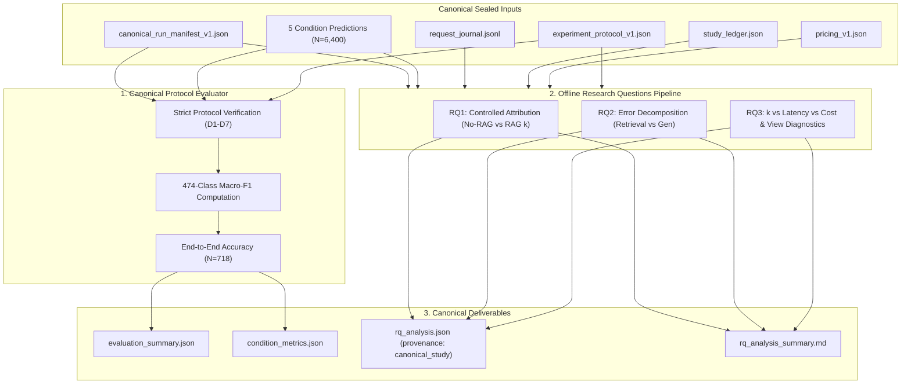

# Phase S2: Canonical Evaluator & Research Questions Execution Plan

- **Author**: Subagent B (Evaluator & Analysis Preparation Specialist)
- **Phase**: S2 (Canonical Evaluator & RQ Execution Planning)
- **Dedicated Worktree**: `D:/RAG2ATTCK-worktrees/prep-evaluator-s1`
- **Branch**: `codex/s1-evaluator-prep` (PR #27)
- **PRE_SHA**: `7cc7a784e06505317626b97bad575fec1f8670d6`
- **Execution Mode**: STRICTLY PLAN-ONLY (ZERO scoring of in-flight live matrix; runner PID untouched; strictly 0 egress)
- **Timestamp**: `2026-10-01T23:45:00Z`
- **Execution Gate**: Awaiting terminal completion of live matrix runner and explicit Codex EXECUTE S2 authorization

---

## 1. Executive Summary & Purpose

This document establishes the authoritative, frozen execution plan for **Phase S2** (Canonical Evaluation & Research Questions Analysis). In strict accordance with the project's frozen protocol principles, this plan is **strictly plan-only**: no evaluation commands are executed against the in-flight live matrix, no prediction files are scored, and runner processes remain untouched.

The primary objective of Phase S2 is to execute the hardened, verified evaluation infrastructure ([`src/evaluation/experiment_metrics.py`](file:///D:/RAG2ATTCK-worktrees/prep-evaluator-s1/src/evaluation/experiment_metrics.py)) and the publication-grade offline analysis pipeline ([`scripts/analysis/evaluate_rqs.py`](file:///D:/RAG2ATTCK-worktrees/prep-evaluator-s1/scripts/analysis/evaluate_rqs.py)) against the sealed canonical dataset snapshot once the live experiment reaches a verified terminal state.

---

## 2. Source Binding & Artifact Input/Output Contracts

### 2.1 Codebase & Engine Bindings

| Component | Repository Path | Frozen Contract / Invariant |
| :--- | :--- | :--- |
| **Canonical Evaluator** | `src/evaluation/experiment_metrics.py` | Governed strictly by `ScientificProtocolApproval` (D1–D7); fail-closed against ad-hoc flags. |
| **Offline RQ Analysis** | `scripts/analysis/evaluate_rqs.py` | Tool v1.2.0; incorporates B_RECONCILE_REPAIR2, B_NATIVE_TARIFF_REPAIR, and BD_MODE_BOUNDARY. |
| **Native Financial Ledger** | `src/experiment/monetary_ledger.py` | Native request cost recalculation (`calculate_request_cost_from_receipts`) and tariff bounds. |
| **Protocol Authorization** | `src/experiment/authorization.py` | Validation of protocol integrity, budget ceilings, and execution authorization tokens. |

### 2.2 Input Artifact Bindings

All Phase S2 commands bind strictly to the sealed, immutable canonical snapshot:

1. **Canonical Manifest**: `artifacts/canonical_run_manifest_v1.json`
   - Defines experiment metadata, split (`test`), sample IDs (1,280 views), conditions, and SHA-256 digests of all frozen reference files.
2. **Prediction Records**: Five condition files residing in the manifest directory:
   - `no_rag_predictions.jsonl`
   - `rag_k1_predictions.jsonl`
   - `rag_k3_predictions.jsonl`
   - `rag_k5_predictions.jsonl`
   - `rag_k10_predictions.jsonl`
3. **Request Journal**: `request_journal.jsonl`
   - Contains append-only execution events: `header`, `monetary_reserve`, `attempt_receipt`, `complete`, `monetary_settle`.
4. **Study-Wide Monetary Ledger**: `artifacts/study_budget/study_ledger.json`
   - Tracks total budget ($20.00), prior pilot hold ($0.05264010), settled records, and uncommitted balance.
5. **Frozen Scientific Protocol**: `config/experiment_protocol_v1.json`
   - Canonical `ScientificProtocolApproval` contract with Decisions D1 through D7.
6. **Pricing Configuration**: `config/pricing_v1.json`
   - Authoritative pricing-v1 model rates (`gpt-5.6-luna`), short/long context thresholds, cached token tariffs, and worst-case bounds.

### 2.3 Output Artifact Directory

All evaluation outputs will be written to:
- **Canonical Evaluation Output Directory**: `outputs/canonical_evaluation/`
- Generated deliverables:
  * `evaluation_summary.json`: Core protocol metrics across all 5 conditions.
  * `condition_metrics.json`: Per-condition precision, recall, F1, and confusion matrices.
  * `rq_analysis.json`: Structured results for RQ1, RQ2, and RQ3 with statistical tests and CIs.
  * `rq_analysis_summary.md`: Publication-grade Markdown summary report.

---

## 3. Evaluation Methodological Invariants

The evaluation execution in Phase S2 is strictly bound by seven non-negotiable methodological invariants established across Decisions D1–D7 and hardened during Phase S1:

### 3.1 Fixed 474-Class Macro-F1 Denominator (`FROZEN_BENCHMARK_UNIVERSE = 474`)
- The Macro-F1 metric evaluates unweighted average performance across the entire frozen benchmark universe of **474 MITRE ATT&CK enterprise techniques**.
- Invariant: Denominator is strictly **474** across all experimental conditions.
- **Strict Prohibition**: Dividing Macro-F1 only by observed classes (e.g., dividing by 3 or observed count) is strictly prohibited. As demonstrated by the Phase S1 distinguishing test, an observed-only denominator inflates Macro-F1 by up to 158x, corrupting cross-study comparability.
- Formula:
  $$\text{Macro-F1} = \frac{1}{474} \sum_{c \in \mathcal{U}_{474}} F_{1,c}$$

### 3.2 `ANY_MATCH` Multi-GT Semantics (Decision D2a)
- For the **40 multi-ground-truth views** in the TEST split, a prediction is classified as a True Positive (TP) if the parsed technique ID matches *any* valid annotated ground-truth technique ID for that view.
- Evaluated symmetrically in Macro-F1 class accumulators.

### 3.3 Excluded Unmapped and Ambiguous Ground-Truth Views (Decisions D2b & D2c)
- Telemetry views that lack attack technique mappings (**251 unmapped views**, D2b) or contain vague/unresolvable technique overlaps (**311 ambiguous views**, D2c) are excluded from the scorable attribution accuracy cohort:
  $$N_{\text{scorable}} = N_{\text{total}} - N_{\text{unmapped}} - N_{\text{ambiguous}} = 1,280 - 251 - 311 = 718$$
- Denominator for scorable accuracy and Macro-F1 on the TEST split is strictly **718 views**.
- Excluded views are explicitly tracked with audit reasons (`UNMAPPED_GROUND_TRUTH`, `AMBIGUOUS_GROUND_TRUTH`) and their financial expenditures are disclosed.

### 3.4 End-to-End Failure Penalization (Decisions D2e & D2f)
- Predictions resulting in parse failures (`INVALID_ID`, `MALFORMED_RESPONSE`, `REFUSAL`) or provider transport errors (`API_FAILURE`, `TIMEOUT`) are **never dropped** from the evaluation denominator.
- They are penalized as incorrect attributions (accuracy = 0.0, F1 penalty) within the scorable cohort.

### 3.5 Independent Failure Axes Evaluation (Decision D2i)
- Failure sources (retrieval miss, provider error, schema failure, invalid syntax, valid-but-wrong classification) are evaluated along independent axes.
- No forced mutual exclusion or unwarranted causal partitioning claims are made.
- Overlaps (e.g., retrieval miss concurrent with misattribution) are explicitly recorded and reported.

### 3.6 Strict Null Zero Denominators (Decision D2j)
- For classes with zero support or zero predictions in a condition, metrics are handled strictly:
  * **Case A (Unobserved in GT, Unpredicted)**: Precision = `None`, Recall = `None`, $F_1 = 0.0$.
  * **Case B (Observed in GT, Unpredicted)**: Precision = $0.0$, Recall = $0.0$, $F_1 = 0.0$.
  * **Case C (Unobserved in GT, Predicted FP)**: Precision = $0.0$, Recall = $0.0$, $F_1 = 0.0$.
- In all cases, unobserved or unpredicted classes strictly contribute **0.0** to the Macro-F1 numerator sum divided by 474.
- In No-RAG, retrieval metrics and conditional generation metrics are set strictly to `null`/`None` (not 0.0).

### 3.7 Native Financial Ledger & Journal Reconciliation
- Request costs are reconciled using native frozen `calculate_request_cost_from_receipts` in `src.experiment.monetary_ledger`.
- Fail-closed contract breach enforcement on missing `service_tier`, foreign models, attempt gaps, or expenditures exceeding logical worst-case ceilings ($2.15898240).
- Retried attempts (`TIMEOUT`, `API_FAILURE`) charged native worst-case attempt fee ($0.53974560).
- Prior pilot hold ($0.05264010) preserved study-wide without inflating individual condition totals.
- Explicit disclosure of three cost denominators:
  1. `cost_per_logical_request_usd` ($N=1,280$)
  2. `cost_per_scorable_query_usd` ($N=718$)
  3. `cost_per_correct_attribution_usd`

---

## 4. Phase S2 Execution Plan: Step-by-Step Commands

### Step 1: Pre-Execution Verification & Integrity Checks

Before invoking any scoring tools, verify that the canonical run directory has reached a clean terminal state:

```bash
# 1. Verify that no background live runner is active
Get-Process python -ErrorAction SilentlyContinue | Select-Object Id, ProcessName, StartTime

# 2. Check existence of canonical run manifest and prediction records
python -c "
import json
from pathlib import Path

manifest_path = Path('artifacts/canonical_run_manifest_v1.json')
assert manifest_path.is_file(), 'Canonical manifest missing'
manifest = json.loads(manifest_path.read_bytes())
assert manifest.get('status') == 'frozen', 'Manifest not frozen'
print(f'Canonical manifest verified: experiment_id={manifest.get(\"experiment_id\")}, split={manifest.get(\"split\")}')
"
```

### Step 2: Canonical Protocol Evaluator Execution

Execute the core evaluator entrypoint through the validated CLI:

```bash
# Execute canonical evaluator against the frozen protocol
uv run python -m src.experiment evaluate \
  --manifest artifacts/canonical_run_manifest_v1.json \
  --protocol-file config/experiment_protocol_v1.json \
  --output-dir outputs/canonical_evaluation/ \
  --repository-root .
```

*Expected Verification*:
- Returns exit code 0.
- Writes `outputs/canonical_evaluation/evaluation_summary.json` containing headline accuracy and 474-class Macro-F1 across all 5 conditions.
- Confirms zero egress (OFFLINE_GUARD active).

### Step 3: Publication-Grade Research Questions (RQ1, RQ2, RQ3) Execution

Execute the hardened offline RQ analysis pipeline:

```bash
# Execute RQ1, RQ2, and RQ3 analyses with 1,000 pair-cluster bootstrap resamples
uv run python scripts/analysis/evaluate_rqs.py \
  --manifest artifacts/canonical_run_manifest_v1.json \
  --protocol-file config/experiment_protocol_v1.json \
  --output-dir outputs/canonical_evaluation/ \
  --pricing-file config/pricing_v1.json \
  --study-ledger-file artifacts/study_budget/study_ledger.json \
  --bootstrap-samples 1000 \
  --seed 42 \
  --repository-root .
```

*Expected Verification*:
- Returns exit code 0.
- Generates `outputs/canonical_evaluation/rq_analysis.json` with `provenance_status="canonical_study"` and `fixture_only=False`.
- Generates `outputs/canonical_evaluation/rq_analysis_summary.md` formatted for publication inclusion.

---

## 5. Research Questions (RQ) Scope & Output Specifications



### 5.1 RQ1: Controlled Attribution Comparison (No-RAG vs. RAG)
- **Scientific Question**: *Does retrieval augmentation significantly improve exact technique attribution over unaugmented generation?*
- **Conditions**: `no_rag` (baseline), `rag_k1`, `rag_k3`, `rag_k5`, `rag_k10`.
- **Metrics Reported**:
  * End-to-end accuracy ($N=718$) and 474-class Macro-F1.
  * Absolute deltas vs baseline: $\Delta \text{Acc} = \text{Acc}_k - \text{Acc}_{\text{no\_rag}}$.
  * Relative gain percentage: $\frac{\text{Acc}_k - \text{Acc}_{\text{no\_rag}}}{\text{Acc}_{\text{no\_rag}}} \times 100\%$.
  * Statistical significance: McNemar test with exact binomial distribution and odds ratios.
  * 95% Confidence Intervals via pair-cluster bootstrap resampling (1,000 resamples clustered by `pair_id`).

### 5.2 RQ2: Retrieval vs. Generation Error Decomposition
- **Scientific Question**: *Are attribution errors primarily driven by retrieval recall failures or downstream LLM misattribution?*
- **Metrics Reported**:
  * Retrieval Recall@k across scorable positive views ($N=718$).
  * Downstream generation accuracy conditioned on retrieval success:
    $$P(\text{Attribution Correct} \mid \text{GT in Retrieved Context})$$
  * Independent failure axes breakdown:
    - Retrieval miss rate
    - Provider / transport failure rate
    - Schema / parse failure rate
    - Invalid ATT&CK ID rate
    - Valid-but-wrong classification rate
  * Explicit overlap counts (e.g., retrieval miss + wrong classification).
  * No-RAG retrieval metrics set strictly to `null`.

### 5.3 RQ3: Retrieval Depth Ablation, Efficiency, & View Diagnostics
- **Scientific Question**: *What are the performance, latency, and cost trade-offs as retrieval depth k increases, and how does representation view affect attribution?*
- **Metrics Reported**:
  * Performance curve: Accuracy and Macro-F1 across $k \in \{0, 1, 3, 5, 10\}$.
  * Latency distribution: Mean, median, 95th percentile, total elapsed latency (ms).
  * Token consumption: Mean prompt, completion, cached, and total tokens.
  * Financial accounting:
    - Reconciled request expenditure per condition via native receipts.
    - Three explicit cost denominators ($N=1,280$, $N=718$, cost/correct attribution).
    - Excluded view spend disclosure (311 ambiguous + 251 unmapped).
    - Study-wide ledger reconciliation including prior pilot hold ($0.05264010).
  * Paired View Diagnostics:
    - Single-View scorable accuracy ($N=278$).
    - Contextual-View scorable accuracy ($N=440$).
    - View accuracy delta and pair concordance (both correct, contextual-only win, single-only win, both incorrect) across $N=359$ complete test pairs.

---

## 6. Exploratory Analysis Boundary & Methodological Disclosures

> [!IMPORTANT]
> **Exploratory Status of Pair-Cluster Resampling & View Diagnostics**:
> - The pair-cluster bootstrap resampling and McNemar view tests implemented in `scripts/analysis/evaluate_rqs.py` are **exploratory secondary diagnostics** designed to inspect potential intra-pair correlation between single and contextual telemetry views.
> - **Strict Prohibition**: Under no circumstances shall these secondary diagnostics be construed as an authorization to modify, weight, or cluster the primary headline protocol. The canonical headline evaluation remains the unweighted Macro-F1 over the 474-class universe and unweighted accuracy over the 718 scorable views.
> - DO NOT infer any instruction to change frozen headline methodology to family clustering or technique weighting based on previous review discussions.

### 6.1 Unit of Analysis Disclosure
- **Headline Scorable Attribution**: Unit of analysis is the individual scorable test view ($N=718$).
- **Exploratory View Diagnostics**: Unit of analysis is the complete telemetry pair ($N=359$ complete pairs on the TEST split).
- **Financial Accounting**: Unit of analysis is the logical request ($N=1,280$ views per condition, $N=6,400$ total matrix requests).

### 6.2 Methodological Assumptions
1. **Attribution Independence**: Primary accuracy assumes independent evaluation of views against the frozen ground-truth standard.
2. **Cluster Exchangeability**: Pair-cluster bootstrap assumes exchangeability of paired units ($p_i$) under resampling.
3. **Fail-Closed Impartiality**: All unresolved decisions must be labeled `HUMAN_DECISION_REQUIRED` before seeing live scores; post-hoc adjustments are strictly forbidden.

---

## 7. Phase S2 Execution Readiness Checklist

- [x] Evaluator engine verified offline with 138/138 passing tests.
- [x] Native tariff and retry accounting verified (`calculate_request_cost_from_receipts`).
- [x] Provenance boundary verified (`execution_mode="live"` yields `canonical_study`).
- [x] Exact CLI commands documented for canonical evaluator and RQ pipeline.
- [x] Methodological invariants (474 universe, ANY_MATCH, D2b/D2c exclusions, D2i independent axes, D2j null rules) confirmed.
- [x] Exploratory boundaries explicitly delineated and insulated from headline protocol.
- [ ] **Execution Gate**: Terminal state of in-flight live matrix verified.
- [ ] **Execution Gate**: Codex EXECUTE S2 authorization received.
